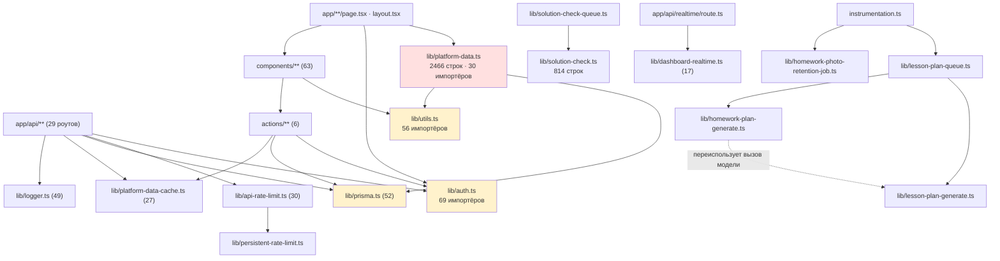

# Аудит архитектуры и качества реализации TutorFlow

**Дата:** 3 августа 2026 · **Коммит:** `1a3bc3d` (main, 413 коммитов с 28.03.2026)
**Область:** 294 файла вне `node_modules`/`.next`/`storage` · 228 модулей `.ts/.tsx` · ~35 300 строк кода
**Метод:** инвентаризация скриптами, граф импортов, глубокое чтение горячих зон, сквозные срезы, проверка воспроизводимости.
**Правки в проект не вносились.** Единственный созданный файл — этот отчёт.

---

## 1. Резюме для владельца

**Общее состояние: лучше, чем ожидаешь от проекта, написанного за 4 месяца одним человеком с ИИ.** Слоёность соблюдается буквально: ни одного импорта `lib → components`, `lib → app`, `components → app`; ни одного обращения к Prisma из `components/`. Циклов в графе импортов нет. Типизация дисциплинированная: **ноль `any`, ноль `@ts-ignore`, ноль `@ts-expect-error`, ноль пустых `catch {}`** во всём коде приложения, `eslint --max-warnings=0` проходит чисто. Доменный инвариант («темы общие, прогресс — на ученика») соблюдён и на уровне схемы, и на уровне кода — контрпримеров не найдено. Единая точка выдачи ДЗ (`lib/homework-issue.ts`) действительно единственная: `homeworkAssignment.create` встречается ровно один раз в репозитории. Самые опасные места — атомарный claim ИИ-проверки и защита от перезаписи ручного статуса ИИ — сделаны правильно, через БД-ограничения, а не «по договорённости».

Это важно сказать прямо, потому что дальше будет длинный список проблем. Проблемы не в том, что код плохой. Проблемы в том, что **проект перешагнул порог, на котором «помню всё в голове» перестаёт работать, а механизмов, которые заменяют память, ещё нет.**

**Семь главных выводов.**

1. **Фича уведомлений на проде, скорее всего, молча не работает.** Модель `Notification` есть в схеме и полностью реализована в коде (`lib/notifications.ts`, колокольчик у ученика, рассылка из дев-панели), но **не создана ни одной из 22 миграций** — проверено скриптовой сверкой всех `CREATE TABLE` со всеми моделями схемы; это единственное расхождение из 25 моделей. Комментарий в самом коде («до `prisma generate + db push`») подтверждает, что таблицу создавали локально через `db push`, а не миграцией. Обёртка `getNotificationDelegate()` глушит ошибку, поэтому ни падения, ни алерта нет — только `logWarnEvent`, который никто не читает. **ARCH-001.**
2. **CI не запускает тесты.** `.github/workflows/ci.yml` делает `npm ci → prisma generate → migrate deploy → lint → build`. Шага `npm run test` нет вообще. 25 тестовых файлов на 2577 строк — включая парсинг ответа ИИ, импорт задачника, политику паролей, стрик — можно сломать, и CI останется зелёным. При этом `CLAUDE.md` требует дописывать тесты при любой правке `lib/`. **ARCH-002.**
3. **Одна и та же операция реализована дважды, и одна из копий невидима.** Создание темы полностью написано и в `actions/topic.ts:85` (`createTopicAction`), и в `app/api/teacher/topics/route.ts`. Форма (`components/topic-create-form.tsx:350`) ходит в API-роут; `createTopicAction` **не импортируется нигде** (проверено grep по всему репозиторию). У API-роута есть rate limit, у мёртвого action — нет. Это ровно тот случай, когда следующая правка бизнес-правила попадёт в одну копию из двух. **ARCH-003.**
4. **`app/globals.css` — самый опасный файл проекта.** 2952 строки, 85 коммитов (первое место по изменчивости). Внутри — две полные системы токенов; старый блок `--theme-*` (строки 8–113) **мёртв по каскаду**, потому что в конце файла (2277–2357) те же переменные переобъявлены как алиасы на `--shbz-*`. ~85 из 194 объявленных классов (44%) не встречаются в коде ни разу — весь неймспейс `.app-*` подтверждённо мёртв (0 совпадений в `app/` и `components/`). Разработчик, который найдёт `--theme-bg` через Ctrl+F, попадёт на мёртвое объявление первым.
5. **`lib/platform-data.ts` — «божественный» модуль, и это следствие правила, а не небрежности.** 2466 строк, 21 экспорт, импортируется 30 файлами. Архитектурное правило «все чтения только здесь» гарантирует, что файл будет расти с каждой фичей. Внутри уже живёт функция на 414 строк (`getLessonPlanContext` — сборка досье для ИИ-промпта, по сути не чтение для рендера) и 212 строк JS-агрегации статистики, которую можно было бы сделать SQL. Два человека, добавляющие разные фичи, будут конфликтовать в этом файле.
6. **Ошибки уходят в тишину системно.** Пустых `catch {}` нет — зато есть **75 мест `.catch(() => null | undefined | [] | {})`**. Самое дорогое: `removeStoredFile` (`lib/storage.ts:384,404,410`) глушит ошибку на всех трёх бэкендах и никогда не логирует — из-за этого три написанных «на всякий случай» error-лога (`lib/stored-files.ts:5-14`, `actions/topic.ts:49-63`, `actions/student.ts:232-239`) структурно недостижимы. При протухших ключах S3 хранилище будет расти вечно, и об этом не узнает никто. Плюс `error.tsx` не логирует ни `error`, ни `error.digest`, а клиентской телеметрии нет вообще.
7. **Документация местами уже неправда.** `README.md` заявляет две роли (реально три — контентом управляет `DEVELOPER`, а не `TEACHER`, поэтому «учитель не может создать тему» — не баг, а недокументированная модель прав), обещает экспорт в `ExcelJS` (пакета нет вообще, реально PDF), описывает страницу списка тем ученика, которой больше нет, и рекомендует Docker-деплой, тогда как `AGENTS.md` фиксирует git+PM2. `CLAUDE.md` заметно точнее, но и в нём перечислены четыре мёртвые функции чтения и не упомянут целиком `actions/developer.ts` и фича уведомлений.

### Что сломается первым, если продолжать наращивать функциональность в текущем виде

**Первым сломается прод при следующем деплое, затрагивающем схему БД — и вы узнаете об этом не от алерта, а от ученика.**

Цепочка конкретная. `Notification` (ARCH-001) уже показывает, что расхождение «локальный `db push` → миграции нет» проходит через все ворота: `tsc` доволен (Prisma-клиент сгенерирован локально), `lint` доволен, `build` доволен, CI зелёный, а на проде фича молча мёртвая. Тестов, которые бы это поймали, нет и не может быть — они по конструкции без БД (ARCH-002). Единственный «датчик» — `logWarnEvent` в обёртке, которая специально написана, чтобы не падать. Следующая фича с новой таблицей уедет в прод тем же путём.

Второе по срочности — **скорость разработки**. Тройной copy-paste board-компонентов планировщика (`teacher-lesson-board` / `teacher-homework-plan-board` / `teacher-student-lessons`, ~700 строк почти идентичного кода) уже разошёлся: интервал поллинга 2000 мс в двух файлах и 2500 мс в третьем, светофор GREEN/YELLOW/RED переопределён локально в обход `homeworkStatusMeta` с другими подписями. Статус ДЗ считается **четырьмя** независимыми способами, и один из них (недельный PDF-отчёт) вообще не смотрит на дедлайн — то есть отчёт и живая страница уже дают учителю разные ответы про одно и то же задание. Каждая новая фича планировщика теперь стоит в 3 раза дороже и с вероятностью ~1/3 разъезжается.

Третье — **прод под нагрузкой пилота**. При 30 учениках × 40 темах × 30 номерах `getTeacherTopicsOverviewUncached` тянет в память полную матрицу статусов (до ~36 000 строк) и агрегирует её в JS, а страница статистики сериализует ту же матрицу целиком в клиентский пейлоад, чтобы показать одну пару «тема+ученик». Кэш при этом сбрасывается любым изменением статуса любым учеником. Это не сломается завтра, но сломается ровно в конце четверти, когда статистика нужнее всего.

**Порядок действий, если делать только самое необходимое: (1) миграция для `Notification` и правило «никакого `db push`»; (2) `npm run test` в CI; (3) убрать одну из двух реализаций создания темы; (4) залогировать ошибки в `removeStoredFile` и `error.tsx`.** Это четыре правки размера S, которые закрывают самый дорогой класс рисков — «сломалось и никто не заметил».

---

## 2. Карта проекта

### 2.1 Дерево модулей

```
Сайт/
├── app/                    79 файлов · 8 420 строк — маршруты (App Router)
│   ├── (auth)/             login + error/loading границы
│   ├── (dashboard)/        оболочки student / teacher(+developer через rewrite)
│   │   ├── student/        кабинет ученика: главная, ДЗ, дедлайны, номер, инфо, настройки
│   │   └── teacher/        темы, ученики, группы, уроки, планы ДЗ, статистика, дев-панель
│   │                       + 3 route.ts для PDF/print (лежат внутри страничного дерева)
│   ├── api/                29 route handlers (student/* и teacher/*)
│   └── files/[fileId]/     единственная точка отдачи файлов
├── components/             63 файла · 11 952 строки — 51 из них "use client"
├── lib/                    50 файлов · 10 600 строк — вся логика и доступ к данным
├── actions/                 6 файлов · 1 717 строк — server actions
├── tests/                  25 файлов · 2 577 строк — чистая логика, без БД
├── prisma/                 schema.prisma (521) + 22 миграции + seed.ts (355)
├── docs/                    4 файла — проектные документы (июль 2026)
└── корень                  15 markdown-файлов (см. Приложение Г)
```

### 2.2 Граф зависимостей

Циклов нет. Протечек слоёв нет: `lib` не импортирует `components`/`app`/`actions`; `components` не импортирует `app`; `prisma.` не встречается в `components/` ни разу.



**«Божественные» узлы** (по числу импортёров): `lib/auth.ts` — 69, `lib/utils.ts` — 56, `lib/prisma.ts` — 52, `lib/logger.ts` — 49, `lib/platform-data.ts` — 30, `lib/api-rate-limit.ts` — 30, `lib/platform-data-cache.ts` — 27. Из них проблемный только `platform-data.ts` — остальные тонкие (`prisma.ts` — 16 строк, `platform-data-cache.ts` — 26, `api-rate-limit.ts` — 45) и по-хорошему централизуют сквозную функциональность.

**Изолируемость `lib/`.** Из 50 модулей 30 можно протестировать в одиночку без БД и сети (чистая логика или тонкая обёртка). 20 модулей тянут Prisma и/или сеть напрямую — см. Приложение В.

**Самый связный узел логики** — планировщик: `lesson-plan-queue` → `lesson-plan-generate` ↔ `homework-plan-generate` → `platform-data.getLessonPlanContext` → `solution-check-parse` (за словарём `ERROR_KINDS`). Очередь общая для уроков и ДЗ, генераторы частично переиспользуют друг друга (`callPlannerModel` — да, `daysBetween`/`writeParticipantError`/`buildCandidatePayload` — заново). `solution-check.ts` — третья независимая реализация «вызов модели с ретраями и backoff», не переиспользующая ничего из двух первых.

### 2.3 Слой → правило → соблюдается ли

| Слой / правило (из `CLAUDE.md`) | Вердикт | Комментарий |
|---|---|---|
| Все чтения БД — через `lib/platform-data.ts`, страницы не ходят в Prisma | **Частично** | 6 страниц ходят напрямую; один и тот же запрос «банк тем» скопирован в 3 файла — **ARCH-016** |
| Записи: server actions для форм, API-роуты для fetch/JSON, выбор осознанный | **Частично** | Есть третий, недокументированный паттерн «action как RPC» (`actions/developer.ts` целиком, 3 функции `group.ts`); есть дубль create-темы — **ARCH-003**, **ARCH-036** |
| Паттерн action: `validate → mutate → revalidate → redirect(?error=…)` | **Частично** | 11 из 25 функций возвращают `{ok,message}` вместо redirect; `requireUser` в начале каждого action может бросить исключение — **ARCH-007** |
| После мутации — хелперы `platform-data-cache` + `revalidatePath` | **Частично** | 3 мутации в `actions/developer.ts` не инвалидируют кэш вообще — **ARCH-036** |
| Файлы только через `/files/[fileId]`, не из `public/` | **Соблюдается** | `public/` нет; прямых ссылок на storage вне трёх разрешённых мест нет |
| Инвариант: темы/номера общие, прогресс — на ученика | **Соблюдается** | `Topic` без FK на пользователя; `@@unique([studentId, homeworkNumberId])` есть в схеме и в миграции |
| Статусы — через `homeworkStatusMeta` / `ui-status-*`, цвета не хардкодить | **Частично** | Для `HomeworkNumberStatus` соблюдается; два board-компонента переопределяют светофор локально, а вердикт ИИ хардкодит `#36e0a4` в двух файлах — **ARCH-019** |
| `lib` изолирована от UI, слои не протекают | **Соблюдается** | 0 нарушений (проверено графом импортов) |
| Тесты при любой правке `lib/` | **Не обеспечено** | CI их не запускает — **ARCH-002** |

---

## 3. Сводная таблица находок

Отсортировано по влиянию на поддерживаемость. «Усилие» — оценка правки, которую этот отчёт **не выполняет**.

| ID | Заголовок | Влияние | Усилие | Где |
|---|---|---|---|---|
| ARCH-001 | Модель `Notification` не создана ни одной миграцией — фича уведомлений мертва на проде | HIGH · инцидент | S | `prisma/schema.prisma:120-133`, `prisma/migrations/**` |
| ARCH-002 | CI не запускает `npm run test` — 25 тестовых файлов декоративны | HIGH · риск багов | S | `.github/workflows/ci.yml:34-58` |
| ARCH-003 | Создание темы реализовано дважды; `createTopicAction` мёртв, но выглядит рабочим | HIGH · риск багов | S | `actions/topic.ts:85-237`, `app/api/teacher/topics/route.ts:31-159` |
| ARCH-004 | `globals.css`: два поколения токенов, мёртвый старый блок, 44% неиспользуемых классов | HIGH · скорость разработки | L | `app/globals.css:8-113,2277-2357` |
| ARCH-005 | `lib/platform-data.ts` — 2466 строк, растёт по конструкции правила | HIGH · скорость разработки | L | `lib/platform-data.ts` |
| ARCH-006 | Мёртвая ветка «обзор тем ученика»: 4 функции чтения + компонент-мост, всё ещё в `CLAUDE.md` | HIGH · онбординг | S | `lib/platform-data.ts:117,197,292,390,865,976`, `components/student-topics-refresh-bridge.tsx` |
| ARCH-007 | Server actions бросают исключения пользователю вопреки заявленному правилу | HIGH · UX/риск | M | `lib/auth.ts:147-211`, все `actions/*.ts` |
| ARCH-008 | Route handlers перебрасывают непредвиденные ошибки — контракт `{error}` ломается на инфраструктурных сбоях | HIGH · риск багов | M | `app/api/**/route.ts` (все) |
| ARCH-009 | 75 мест `.catch(() => …)`; `removeStoredFile` делает три error-лога недостижимыми | HIGH · тихая деградация | S | `lib/storage.ts:384,404,410` + 74 места |
| ARCH-010 | Ambient `.d.ts` шимы навсегда перекрывают типы пакетов; весь PDF-отчёт нетипизирован | HIGH · риск багов | M | `pdfjs-dist.d.ts`, `react-pdf.d.ts`, `lib/weekly-report-pdf.tsx` |
| ARCH-011 | Гонка в выдаче ДЗ: номер может попасть в два активных ДЗ, отмена одного стирает дедлайн | HIGH · порча данных | M | `lib/homework-issue.ts:93-157` |
| ARCH-012 | `resumeStaleLessonPlans` пропускает именно те задачи, которые оборвал рестарт | HIGH · зависание фичи | S | `lib/lesson-plan-queue.ts:87-148` |
| ARCH-013 | Удаление темы каскадно уносит фото решений, вердикты ИИ и итоги уроков всех учеников | HIGH · потеря данных | L | `actions/topic.ts:557-566`, `prisma/schema.prisma:172,200,310,410,500` |
| ARCH-014 | Тройной copy-paste board-компонентов планировщика (~700 строк), копии уже разошлись | HIGH · скорость разработки | M | `components/teacher-{lesson,homework-plan}-board.tsx`, `teacher-student-lessons.tsx` |
| ARCH-015 | `README.md` описывает несуществующие роли, зависимость и способ деплоя | HIGH · онбординг | S | `README.md:21,23,32,61,169,284-326` |
| ARCH-016 | 6 страниц ходят в Prisma мимо `platform-data.ts`; один запрос продублирован трижды | MEDIUM · риск багов | M | `app/(dashboard)/teacher/{panel,lessons,homework-plans,students}/**` |
| ARCH-017 | Два полностью реализованных API-роута без единого клиента | MEDIUM · мёртвый код | M | `app/api/teacher/student-deadlines/route.ts`, `.../topics/order/route.ts` |
| ARCH-018 | `.env.example` физически повреждён; 6 переменных не описаны; дефолт ИИ-эндпоинта — чужой провайдер | MEDIUM · инцидент | S | `.env.example`, `lib/solution-check.ts:45` |
| ARCH-019 | Статус ДЗ вычисляется 4 способами; PDF-отчёт не видит дедлайн | MEDIUM · неверные данные | M | `.../export/pdf/route.ts:46-60` + 3 места |
| ARCH-020 | Полная матрица «тема × номер × ученик» в память и в клиентский пейлоад | MEDIUM · деградация под нагрузкой | M | `lib/platform-data.ts:489-524`, `app/(dashboard)/teacher/statistics/page.tsx:195-213` |
| ARCH-021 | Мёртвая поверхность схемы: 9 полей и связь `prerequisites` без единого чтения; `answerFileId` никогда не заполняется | MEDIUM · онбординг | M | `prisma/schema.prisma:149-150,171,213-214,255-257,276-303` |
| ARCH-022 | Тесты по конструкции не покрывают БД, API, actions и права; 20 модулей `lib/` без тестов | MEDIUM · риск багов | L | `tests/**`, см. Приложение В |
| ARCH-023 | Три компонента помечены `"use client"` без единого хука | LOW · вес бандла | S | `components/{deadline-list,teacher-topic-view-numbers,student-weekly-activity}.tsx` |
| ARCH-024 | `.font-display` ссылается на шрифт Inter, который нигде не подключается | LOW · визуальный баг | S | `app/globals.css:10-11,137` vs `app/layout.tsx:3` |
| ARCH-025 | `logInfo/logWarn/logError` мертвы; 41 из 158 имён событий выпадают из схемы логов | LOW · наблюдаемость | S | `lib/logger.ts:51-83,183-205` |
| ARCH-026 | SSE-клиент реконнектится вечно без бэкоффа; каждая попытка — Serializable-транзакция | MEDIUM · нагрузка | S | `components/dashboard-realtime-listener.tsx:66-120`, `app/api/realtime/route.ts:29-45` |
| ARCH-027 | У ИИ-планировщика нет ни дневного бюджета, ни потолка очереди (в отличие от автопроверки) | MEDIUM · стоимость | S | `lib/lesson-plan-queue.ts`, `app/api/teacher/lessons/route.ts:36` |
| ARCH-028 | Устаревший `issuedAssignmentId` навсегда «подвешивает» черновик ДЗ | MEDIUM · UX | S | `app/api/teacher/homework-plans/[planId]/issue/route.ts:92` |
| ARCH-029 | Валидация входа написана заново в каждом роуте; нет лимитов длины LaTeX и верхней границы номера | MEDIUM · риск багов | M | `app/api/teacher/{number-answers,number-conditions,topics/find-number}/route.ts` |
| ARCH-030 | `@eslint/eslintrc` импортируется, но не объявлен в `package.json` | LOW · сборка | S | `eslint.config.mjs:3`, `package.json` |
| ARCH-031 | `saveSiteSettings` пишет 16 строк без транзакции | LOW · согласованность | S | `lib/site-settings.ts:246-258` |
| ARCH-032 | Финализация ИИ-проверки и применение статусов — две несвязанные транзакции | MEDIUM · порча данных | M | `lib/solution-check.ts:726-769` |
| ARCH-033 | Нет индекса под общий (без ученика) прогресс-таймлайн | MEDIUM · производительность | S | `lib/platform-data.ts:892-912`, `prisma/schema.prisma` |
| ARCH-034 | Два дизайн-языка (`ui-*`/`--theme-*` и `shbz-*`) сосуществуют, местами в одном файле | MEDIUM · скорость разработки | M | `components/page-header.tsx` vs `shbz-page-header.tsx` + 13 файлов |
| ARCH-035 | `{error:"Unauthorized"}` по-английски глушит русский фолбэк на клиенте | LOW · UX | S | ~20 роутов `app/api/teacher/**` |
| ARCH-036 | 3 мутации дев-панели не инвалидируют кэш; `actions/developer.ts` не упомянут в `CLAUDE.md` | MEDIUM · неверные данные | S | `actions/developer.ts:95,135,185` |
| ARCH-037 | 4 миграции написаны вручную мимо `prisma migrate dev` (12-значный префикс) | LOW · процесс | S | `prisma/migrations/2026032914*`–`2026032922*` |
| ARCH-038 | Клиентское «сегодня» считается по таймзоне браузера, серверное — по `TZ=Europe/Moscow` | MEDIUM · неверные данные | S | `components/deadlines-calendar.tsx:12-17,64`, `shbz-datetime-picker.tsx:44-50` |
| ARCH-039 | Ошибки `error.tsx` и весь клиент не логируются нигде; нет `global-error.tsx` | MEDIUM · наблюдаемость | S | `app/(auth)/error.tsx:5-10`, `app/(dashboard)/error.tsx:5-10` |
| ARCH-040 | 15 markdown-файлов в корне: большинство — исполненные ТЗ, часть дублирует код | LOW · онбординг | S | корень репозитория |
| ARCH-041 | Границы, где типы утверждаются, а не проверяются: ответ своего же API, Prisma-enum, `FormData` | MEDIUM · риск багов | S | `components/topic-import-panel.tsx:14-31`, `lib/solution-check.ts:749` |
| ARCH-042 | Пять `!` в `actions/topic.ts` компенсируют потерянную аннотацию `: never` | LOW · риск при рефакторинге | S | `actions/topic.ts:31,36,249,453,459,536` |
---

## 4. Находки

### 4.1 Файлы и их место

#### ARCH-040 — 15 markdown-файлов в корне: большинство — исполненные ТЗ, часть дублирует код

- **Влияние:** LOW — стоимость онбординга: новый участник не может отличить актуальный документ от отработанного.
- **Уверенность:** проверено чтением (все 15 файлов + 4 в `docs/`).
- **Где:** корень репозитория; полная разметка — Приложение Г.

**Что есть сейчас.** В корне лежат `PROMPTS.md` (35 КБ), `PROMPTS_AUDIT.md` (27 КБ), `PROMPTS_PLAN.md` (26 КБ), `PROMPTS_TASK.md` (28 КБ) — одна цепочка от 31.07.2026, чьё содержание (диагностика ошибок в досье, бюджет ДЗ `dailyMinutes × studyDays`) **уже реализовано** и описано в `CLAUDE.md` как текущая архитектура. `PROMPT_AI_LESSON_PLANNER.md` (42 КБ) и `PROMPT_AI_HOMEWORK.md` (23 КБ) — ТЗ на фичи, которые реализованы. `PROMPT_LATEX_WRAP.md` описывает CSS-баг, фикс которого уже применён (`min-w-0` присутствует в 4 компонентах). `TOPIC_IMPORT_TASK.md` — исполненное ТЗ. `TZ_TutorFlow_MVP.md` и `TZ_TutorFlow_kratko.md` — от 24.06.2026, оба упоминают выгрузку в Excel как готовую. Итого ~230 КБ текста, из которых актуальны `CLAUDE.md`, `AGENTS.md` и (как внешняя инструкция) `TOPIC_IMPORT_PROMPT.md`. Четыре из них не в git (untracked): `PROMPTS*.md`, `TOPIC_IMPORT_TASK.md`.

Отдельно: `TOPIC_IMPORT_PROMPT.md` **дословно дублирует** содержимое `lib/topic-import-prompt.ts` — текст промпта живёт в двух местах и должен редактироваться синхронно.

**Почему это проблема.** Человек (или ИИ-агент), которому дали репозиторий, читает корень сверху вниз и тратит время на 230 КБ документов, описывающих будущее, которое уже стало прошлым. `TZ_TutorFlow_MVP.md` при этом — единственный документ, который выглядит как «спецификация продукта», и он врёт про Excel. Дубль промпта импорта разъедется при первой же правке формата JSON.

**Оценка трудоёмкости:** S — перенести исполненные ТЗ в `.planning/archive/` или `docs/history/`, оставить в корне `README`/`CLAUDE`/`AGENTS`; `TOPIC_IMPORT_PROMPT.md` генерировать из `lib/topic-import-prompt.ts`, а не хранить копию.

#### Файлы не на своём месте

Существенных нарушений нет. Три замечания уровня «к сведению»:

- три `route.ts` живут в страничном дереве, а не в `app/api/` — `teacher/lessons/[lessonId]/{pdf,print}/route.ts` и `teacher/students/[studentId]/export/pdf/route.ts`. Это законно для Next.js и даже осмысленно (ссылки в UI ведут на них как на страницы), но `CLAUDE.md` описывает `app/api/**` как «место всех роутов», а самый большой роут проекта (443 строки) лежит не там;
- `lib/weekly-report-pdf.tsx` — единственный `.tsx` в `lib/` (JSX для `@react-pdf/renderer`); формально UI в слое логики, практически — изолирован правильно (в клиентский бандл не попадает);
- `components/use-streak-motion.ts` — хук среди компонентов; мелочь, но `lib/` был бы честнее.

---

### 4.2–4.3 Неиспользуемое, дублирующееся, мёртвое

#### ARCH-003 — Создание темы реализовано дважды; `createTopicAction` мёртв, но выглядит рабочим

- **Влияние:** HIGH — риск багов: правка бизнес-правила попадёт в одну копию из двух, и невидимую копию никто не проверит.
- **Уверенность:** проверено инструментом (`grep -rn "createTopicAction"` по всему репозиторию: единственное совпадение — строка объявления).
- **Где:** `actions/topic.ts:85-237` (мёртв) vs `app/api/teacher/topics/route.ts:31-159` (работает); клиент — `components/topic-create-form.tsx:350`.

**Что есть сейчас.** `createTopicAction` — 153 строки: валидация, загрузка/переиспользование файлов, транзакция создания темы и номеров, ревалидация, redirect. Он перечислен в `CLAUDE.md` как часть `actions/topic.ts`. Он не импортируется ни одним файлом. Единственная форма создания темы (`TopicCreateForm`, подключена в `app/(dashboard)/teacher/topics/page.tsx:103`) делает `fetch("/api/teacher/topics")`, у которого своя независимая транзакция и свой rate limit `enforceApiRateLimit("api:topics-create", …, 12, 60_000)`, которого у action нет.

**Почему это проблема.** Сценарий предельно конкретный: завтра появляется требование «при создании темы автоматически ставить `displayOrder` в конец и слать уведомление ученикам». Разработчик открывает `actions/topic.ts` (это же «место, где живёт CRUD темы» по `CLAUDE.md`), правит `createTopicAction`, прогоняет lint и build — всё зелёное, потому что файл действительно импортируется другими страницами (ради `updateTopicAction`/`deleteTopicAction`). Фича не работает, и понять почему — это найти, что форма ходит в API. IDE не подсветит мёртвый экспорт, ESLint в текущей конфигурации (`next/core-web-vitals`) — тоже.

**Оценка трудоёмкости:** S — удалить `createTopicAction` и явно записать в `CLAUDE.md`, что создание темы идёт через API-роут (форма делает клиентскую загрузку файлов в Blob, поэтому API-путь, вероятно, и был выбран осознанно — просто это не задокументировано).

#### ARCH-006 — Мёртвая ветка «обзор тем ученика»: четыре функции чтения и компонент-мост, всё ещё документированные

- **Влияние:** HIGH — стоимость онбординга: `CLAUDE.md` называет эти функции текущим API чтения, то есть карта проекта показывает несуществующую дорогу.
- **Уверенность:** проверено инструментом (grep по всему репозиторию, вне `lib/platform-data.ts` — ноль совпадений).
- **Где:** `lib/platform-data.ts:117` (`getStudentTopicsOverviewUncached`), `:197` (`getStudentTopicsOverview`), `:292`/`:390` (`getStudentTopicDetail*`), `:865` (`getStudentDeadlines`), `:976` (`getDashboardSummary`); `lib/student-deadline-groups.ts:21` (`groupStudentDeadlinesAsAssignments`); `components/student-topics-refresh-bridge.tsx` целиком; мёртвый импорт — `components/student-single-number-card.tsx:9`.

**Что есть сейчас.** Роута `app/(dashboard)/student/topics/**` не существует (был удалён — в истории git файл `app/(dashboard)/student/topics/[topicId]/page.tsx` менялся 22 раза). Вместе с ним осиротели: четыре функции чтения (~250 строк с кэш-обёртками), функция группировки дедлайнов (жива только в тестах), компонент `StudentTopicsRefreshBridge` (нигде не рендерится) и функция `markStudentTopicsNeedsRefresh`, которая импортируется в живой, часто открываемый `student-single-number-card.tsx`, но ни разу там не вызывается. `getStudentDeadlines` и `getStudentTopicsOverview` при этом перечислены в `CLAUDE.md` в списке «Reads».

Дополнительно: `groupStudentDeadlinesAsAssignments` и живая `mapStudentHomeworksToDeadlineItems` лежат в одном файле, решают одну задачу и **уже разошлись** — первая считает ДЗ «в работе» при любом непустом статусе (включая RED), вторая — только при `solvedCount > 0`. Расхождение зафиксировано тестом `tests/student-deadline-groups.test.ts:58-83`, который проверяет мёртвую ветку.

**Почему это проблема.** Разработчик, которому поручено «починить, что ДЗ с одними красными помечается как начатое», найдёт по тестам мёртвую функцию, поправит её, увидит зелёные тесты и закроет задачу. На экране ничего не изменится. Это худший вид мёртвого кода — не просто балласт, а балласт с тестами и упоминанием в архитектурной документации.

**Оценка трудоёмкости:** S — удалить мёртвые функции, компонент-мост, мёртвый импорт и соответствующие тесты; синхронизировать список «Reads» в `CLAUDE.md`.

#### ARCH-017 — Два полностью реализованных API-роута без единого клиента

- **Влияние:** MEDIUM — мёртвый код с полным обвесом (валидация, rate limit, ревалидация, уведомления), который выглядит как работающая функциональность.
- **Уверенность:** проверено инструментом (grep `api/teacher/student-deadlines|api/teacher/topics/order` по всему репозиторию: совпадения только в сгенерированных `.next/types`).
- **Где:** `app/api/teacher/student-deadlines/route.ts` (266 строк, POST), `app/api/teacher/topics/order/route.ts` (114 строк, POST).

**Что есть сейчас.** Оба роута написаны аккуратно: проверка роли, `enforceApiRateLimit`, транзакция, `revalidate*`, `publishDashboardRealtimeEvent`, уведомления ученику. Ни один `.ts/.tsx` файл их не вызывает. `topics/order` явно предполагает кнопки «вверх/вниз» на странице тем — их нет; `student-deadlines` предполагает массовое проставление дедлайнов — интерфейса нет. При этом `lib/teacher-topic-selection.ts` (166 строк, покрыт тестом на 167 строк) существует только ради `topics/order` и `topics/find-number`.

**Почему это проблема.** Контракт этих роутов не проверяется ничем — ни клиентом, ни тестом, ни типами. При следующей миграции схемы они молча разъедутся (например, `student-deadlines` уже содержит defensive-обработку отсутствующих колонок `note`/`deadlineAt` — код, который поддерживают, но никогда не выполняют). Плюс это открытая, ничем не используемая точка записи в API: `student-deadlines` дедуплицирует `homeworkNumberIds`, но **не ограничивает длину массива** (в отличие от `studentIds`, где применяется `MAX_GROUP_SIZE=30`), то есть прямым вызовом можно инициировать одну очень большую транзакцию.

**Оценка трудоёмкости:** M — решить продуктово: либо довести до UI (перетаскивание тем — заявленная в `CLAUDE.md` фича «topic reorder»), либо удалить вместе с `teacher-topic-selection.ts` в части reorder.

#### ARCH-021 — Мёртвая поверхность схемы: 9 полей и связь без единого чтения; `answerFileId` никогда не заполняется

- **Влияние:** MEDIUM — стоимость онбординга и лишняя работа БД: индексы под мёртвые поля обслуживаются на каждой записи.
- **Уверенность:** проверено инструментом (grep каждого поля по `app/ components/ lib/ actions/`: 0 файлов).
- **Где:** `prisma/schema.prisma:149-150` (`prerequisites`/`requiredFor` + таблица `_TopicPrereqs`), `:171` (`usableInDiagnostic` + индекс), `:213-214` (`levelScore`/`placedAt`), `:255-257` (`Lesson.startsAt`/`startedAt`/`finishedAt`), `:276,283-285,293` (`attendance`/`joinedAt`/`queueOrder` + индекс/`helpedAt`), `:303` (`forReview`). Отдельно — `TopicHomeworkNumber.answerFileId`.

**Что есть сейчас.** Девять полей и одна self-relation описаны в схеме, созданы миграциями (то есть колонки и индексы реально существуют в БД), но не читаются и не пишутся нигде, кроме дефолтов при вставке. `CLAUDE.md` честно помечает `TopicMastery`/`Test*` как «код ещё не написан», но про `prerequisites` и поля `LessonParticipant` такой пометки нет.

Отдельный случай — `answerFileId` («файл-ответ к номеру»). Поле читается в пяти местах (для очистки и для проверки «есть ли что удалять»), но **не присваивается ненулевое значение нигде**: `app/api/teacher/number-answers/route.ts:71,153` всегда пишет `answerFileId: null`. То есть путь записи фичи удалён, путь чтения и очистки остался. Проверено: единственное вхождение `answerFileId:` с ненулевым значением — `lib/stored-files.ts:25`, и это `where`-условие подсчёта использований, а не запись.

**Почему это проблема.** Разработчик, открывший схему, видит богатую модель урока (посещаемость, очередь у доски, «помогли в», начало/конец) и достраивает в голове функциональность, которой нет. Хуже: следующая фича «живая очередь на уроке» с высокой вероятностью начнётся с «а, тут уже есть `queueOrder`», а потом выяснится, что вокруг него нет ничего. `answerFileId` — ловушка второго рода: код удаления файлов-ответов поддерживается и правится, хотя таких файлов не может появиться.

**Оценка трудоёмкости:** M — продуктовое решение: либо явно пометить в `CLAUDE.md` (как уже сделано для `Test*`), либо убрать отдельной миграцией. Для `answerFileId` — определиться, жива ли фича.

#### ARCH-025 — `logInfo/logWarn/logError` мертвы; 41 из 158 имён событий выпадает из схемы логов

- **Влияние:** LOW — наблюдаемость: алерт по `outcome:"failed"` не увидит целые домены.
- **Уверенность:** проверено инструментом (grep `\blog(Info|Warn|Error)\(` — только три строки объявления).
- **Где:** `lib/logger.ts:183-205` (мёртвые функции), `:51-83` (`splitLogEvent`); двухчастные имена — `actions/group.ts:63,72,99,102,132,135,179,184,214,219`, весь `actions/developer.ts`, весь `lib/pdf-renderer.ts`, `app/api/teacher/lessons/route.ts:146,172`, `app/api/teacher/homework-plans/**`.

**Что есть сейчас.** `splitLogEvent` формирует структурное поле `outcome` только при трёх и более точечных сегментах. 104 события из 158 имеют три сегмента, 13 — четыре, а **41 (26%) — два** и потому `outcome` не получают. При этом успех и провал одной операции часто названы в разной нотации: `group.created` / `group.create.failed`, `homework_plan.issued` / `homework_plan.issue_failed`, `site_settings.updated` / `site_settings.update_failed`. Плюс три экспортируемые функции логирования без событийного имени, которые никто не использует.

**Почему это проблема.** Дашборд «сколько операций упало за сутки» по полю `outcome` покажет правильные числа для тем и проверок, и ноль — для групп, дев-панели и генерации PDF. Разработчик, копирующий соседний код, может взять `logWarn` вместо `logWarnEvent` — и его лог выпадет из схемы целиком.

**Оценка трудоёмкости:** S — удалить три мёртвые функции, привести 41 имя к `domain.action.outcome`; при желании — тест, проверяющий формат имён (`tests/logger.test.ts` уже есть).

#### ARCH-030 — `@eslint/eslintrc` импортируется, но не объявлен в `package.json`

- **Влияние:** LOW — отложенный риск поломки CI.
- **Уверенность:** проверено инструментом (`grep eslintrc package.json` — пусто; в `package-lock.json` пакет присутствует как транзитивный).
- **Где:** `eslint.config.mjs:3`.

**Что есть сейчас.** Конфиг ESLint импортирует `FlatCompat` из `@eslint/eslintrc`. Пакета нет ни в `dependencies`, ни в `devDependencies`; он резолвится потому, что `eslint`/`eslint-config-next` тянут его транзитивно, и npm поднимает его в корень `node_modules`. `package-lock.json` в репозитории **есть** (364 КБ), поэтому `npm ci` сегодня воспроизводит рабочее дерево — риск не сиюминутный.

**Почему это проблема.** Достаточно обновления мажорной версии `eslint-config-next`, которое уберёт транзитивную зависимость, или перехода на pnpm (который по умолчанию не «хостит» транзитивные пакеты) — и `npm run lint` перестанет находить модуль. Поскольку lint стоит в CI перед build, красным станет вообще всё, и причина будет неочевидной.

**Оценка трудоёмкости:** S — добавить `@eslint/eslintrc` в `devDependencies`.

#### Прочие кандидаты в мёртвый код

Полный список с уверенностью и способом проверки — Приложение Б. Кратко: экспортируемые типы, используемые только внутри своего файла (`AccountNotice`, `DeveloperPanelStats`, `ShbzSelectOption`, `StudentStreakMotionState`); `revalidateStudentTopicsData` (вызывается только внутри `revalidateAllPlatformData`, хотя `CLAUDE.md` предлагает её как самостоятельную точку); поля `answerForNumberEntries`/`checkPhotoEntries` в `FileAccessCounts`, которые собираются в `app/files/[fileId]/route.ts:64-72`, но не читаются в `canAccessStoredFile`.

---

### 4.4 Зависимости между модулями и циклы

**Циклов нет. Протечек слоёв нет.** Проверено скриптом на графе импортов всех 228 модулей: ни одного `lib → components`, `lib → app`, `lib → actions`, `components → app`. Обращений к `prisma.` из `components/` — ноль. Это заметно лучше, чем типично для проектов такого возраста, и это стоит сохранить.

#### ARCH-005 — `lib/platform-data.ts`: 2466 строк, 21 экспорт, рост заложен в правило

- **Влияние:** HIGH — скорость разработки: файл станет точкой конфликта, как только над проектом будут работать двое.
- **Уверенность:** проверено инструментом (подсчёт строк, экспортов, импортёров) и чтением.
- **Где:** `lib/platform-data.ts` целиком; особо — `:1924-2337` (`getLessonPlanContext`, 414 строк), `:1379-1590` (`getDeveloperStatisticsUncached`, 212 строк).

**Что есть сейчас.** Модуль импортируется 30 файлами и держит внутри 13 разных ответственностей: чтения ученика, чтения учителя, дедлайны, таймлайн, статистика, группы, уроки, планы ДЗ, кэш-обёртки, capability-detection для деградации при неприменённой миграции — и, отдельно, **сборку досье для ИИ-промпта** (`getLessonPlanContext`), которая по природе не «чтение для рендера», а построение датасета. Правило `CLAUDE.md` «вся агрегация чтения только здесь» означает, что каждая новая фича с новым экраном обязана добавить сюда ещё функцию.

**Почему это проблема.** Пока разработчик один, это неудобно, но терпимо. Как только их двое: фича «статистика по группам» и фича «новый экран урока» правят один файл в 60 строках друг от друга, и каждый мердж-конфликт в файле на 2466 строк требует понять чужую фичу целиком. Отдельно: ревью диффа по такому файлу не работает — невозможно на глаз отличить «переставили две функции» от «изменили условие в третьей».

**Оценка трудоёмкости:** L — разбить на подмодули по доменам (`platform-data/topics.ts`, `/students.ts`, `/lessons.ts`, `/statistics.ts`) с сохранением единой точки для кэш-тегов; отдельно вынести `getLessonPlanContext` в `lib/lesson-plan-context.ts` — это не чтение, это подготовка промпта.

#### ARCH-016 — Шесть страниц ходят в Prisma мимо `platform-data.ts`; один запрос продублирован трижды

- **Влияние:** MEDIUM — риск багов и расхождение с заявленным правилом; эти чтения не участвуют в системе кэш-тегов.
- **Уверенность:** проверено инструментом (grep `prisma\.` по `app/**/page.tsx`).
- **Где:** `app/(dashboard)/teacher/panel/page.tsx:30-41` (8 запросов, `platform-data` не используется вообще), `teacher/lessons/[lessonId]/page.tsx:26`, `teacher/lessons/new/page.tsx:40,56`, `teacher/homework-plans/new/page.tsx:24,37,92`, `teacher/homework-plans/[planId]/page.tsx:34,46`, `teacher/students/[studentId]/lessons/page.tsx:21`.

**Что есть сейчас.** Шесть серверных компонентов читают Prisma напрямую. Запрос «банк тем для ручного добавления номера» (одинаковые `select` и `orderBy`) скопирован дословно в три из них. Все эти чтения идут мимо `unstable_cache` и мимо тегов `platform-data:*`.

**Почему это проблема.** Правило «читать только через `platform-data`» существует ради того, чтобы `revalidateAllPlatformData()` действительно инвалидировал всё. Эти шесть страниц из системы выпадают: они не кэшируются (то есть бьют в БД на каждый запрос) — и это скорее хорошо, чем плохо, но это значит, что поведение страниц неоднородно и никто не знает, где какое. Тройной дубль «банка тем» — классический дрейф: правка `select` в одном месте не попадёт в два других.

**Оценка трудоёмкости:** M — вынести «банк тем» одной функцией в `platform-data.ts`, остальное либо перенести туда же, либо явно записать в `CLAUDE.md` исключение «страницы уроков/планов читают напрямую, потому что данные не кэшируются».

---

### 4.5 Большие компоненты и функции

Файлов >300 строк — 24. Функций >60 строк — 135. Компонентов с >10 пропсами — один (`DeleteButton`, 14). Компонентов с >5 `useState`/`useEffect` — десять, максимум `TopicImportPanel` (10 `useState`). Полные таблицы — в разделе 4.5 Приложения А.

Приоритет здесь выставлен по **изменчивости × размеру**, а не по размеру: 477-строчный `lib/weekly-report-pdf.tsx`, который правят раз в месяц, — меньшая проблема, чем 517-строчный board, который правят каждую неделю в трёх копиях.

#### ARCH-004 — `app/globals.css`: два поколения токенов, мёртвый старый блок, 44% неиспользуемых классов

- **Влияние:** HIGH — скорость разработки: файл №1 по изменчивости (85 коммитов), и примерно треть правок в нём попадает в код, который ничего не стилизует.
- **Уверенность:** проверено инструментом (извлечение всех 194 объявленных классов + сверка с кодом; подсчёт строк внутри правил, все классы которых мертвы) и чтением.
- **Где:** `app/globals.css:8-65` и `:70-113` (исходные `--theme-*`), `:2277-2316` и `:2318-2357` (те же переменные как алиасы на `--shbz-*`), `:1624` (граница двух систем); дубли селекторов — `.ui-kicker` (575 и 2531, **с разными значениями**), `.ui-readonly-field` (719/2424), `.ui-metric-pill` (322/2586), `.ui-form-label` (742/2430), `.soft-grid` (207/2360), `.shbz-btn-danger` (2170/2891).

**Что есть сейчас.** 2952 строки. Селектор `:root` объявлен пять раз, плюс парные к нему блоки `html[data-theme="dark"]`. Все 39 переменных `--theme-*` объявлены дважды: первый раз хардкод-значениями в начале, второй — в блоке-адаптере в конце, где они переопределены как `var(--shbz-*)`. По правилам каскада побеждает второе, то есть строки 8–113 полностью мертвы, но физически остаются. 85 из 194 классов не встречаются в коде ни разу; весь неймспейс `.app-*` (`app-topbar`, `app-brand-link`, `app-dashboard-frame`, `app-streak-pill` и т.д.) подтверждённо мёртв — реальная навигация `components/dashboard-nav.tsx` использует только `shbz-*`. По консервативной оценке 686 из 1859 «классовых» строк вне `@media` (37%) состоят только из мёртвых классов.

**Почему это проблема.** Сценарий, который случится: нужно поменять цвет фона страницы. Разработчик ищет `--theme-bg`, находит строку 26, меняет `#f1f5f9` на нужное, перезагружает — ничего не изменилось, потому что работает строка 2278. Дальше он либо тратит полчаса на дебаг каскада, либо (чаще) дописывает третье объявление в конец файла — и файл растёт ещё. Именно так он и вырос до 2952 строк: `.shbz-btn-danger` определён на строке 2170 и дополнен на 2891, в 700 строках от себя.

**Оценка трудоёмкости:** L — это отдельная задача с проверкой каждой затронутой страницы: удалить исходный блок `--theme-*` и адаптер, переименовав всё на `--shbz-*`; вычистить мёртвые классы по списку; закрепить правило «правим на месте объявления, не дописываем в конец».

#### ARCH-014 — Тройной copy-paste board-компонентов планировщика; копии уже разошлись

- **Влияние:** HIGH — скорость разработки: вся UI-часть самой активно развиваемой фичи стоит втрое дороже.
- **Уверенность:** проверено чтением всех трёх файлов.
- **Где:** `components/teacher-lesson-board.tsx:91-231` (518 строк файл), `components/teacher-homework-plan-board.tsx:91-230` (533), `components/teacher-student-lessons.tsx:103-251` (498).

**Что есть сейчас.** Три компонента содержат почти идентичные блоки: `useEffect`-поллинг статуса генерации, `saveItems`, `regenerate`, обработка `stale`. Дословно продублированы объекты `reasonMeta` (GAP/REVIEW/NEW) и `statusMeta` (светофор). **Разошлись уже сейчас:** интервал поллинга 2000 мс в двух файлах и 2500 мс в третьем; один поллит один урок, другой — набор через `Set`; кнопка «Пересобрать» получает `disabled={busy || pending || !aiAvailable}`, а кнопка «Повторить» в тех же файлах (`teacher-lesson-board.tsx:344`, `teacher-homework-plan-board.tsx:362,372`, `teacher-student-lessons.tsx:385`) — не получает ничего.

**Почему это проблема.** Требование «при ошибке сети поллить с экспоненциальным бэкоффом и показывать баннер» нужно реализовать трижды, и третий раз кто-нибудь забудет. Уже сейчас двойной клик по «Повторить» ставит в очередь две генерации одного участника (очередь не дедуплицирует, см. ARCH-027) — то есть двойной расход на ИИ.

**Оценка трудоёмкости:** M — вынести общий хук `usePlanGenerationPolling(ids, endpoint)` и общий модуль `lesson-plan-meta.ts` со светофором и `reasonMeta`; светофор при этом переиспользовать из `lib/utils.ts:homeworkStatusMeta`, а не копировать (см. ARCH-019).

#### ARCH-020 — Полная матрица «тема × номер × ученик» в память и в клиентский пейлоад

- **Влияние:** MEDIUM — деградация под нагрузкой ровно в момент, когда данными пользуются больше всего.
- **Уверенность:** проверено чтением всей цепочки от запроса до пропсов.
- **Где:** `lib/platform-data.ts:489-524` (`getTeacherTopicsOverviewUncached`), `:1408-1419` (`getDeveloperStatisticsUncached`), `:2384` (`getLessonDetail` — статусы всех учеников по каждому номеру); клиентская часть — `app/(dashboard)/teacher/statistics/page.tsx:195-213,419` → `components/teacher-statistics-drilldown.tsx:29-31`.

**Что есть сейчас.** `topic.findMany` без фильтра по ученику вытягивает `statuses` для каждого номера каждой темы — то есть полную матрицу. Дальше `page.tsx` перекладывает её целиком в пропсы клиентского компонента, который показывает **одну** пару «тема+ученик» за раз и фильтрует на клиенте через `useMemo`. Агрегация (`getStatusCounts`, `Map`/`Set`) делается в JS, хотя рядом, в `getGroupDetail` (`:1712-1717`), уже используется правильный `prisma.groupBy` — паттерн в кодовой базе есть, просто не применён здесь.

**Почему это проблема.** 30 учеников × 40 тем × 30 номеров = до 36 000 строк на каждый холодный пересчёт, и столько же в HTML/RSC-пейлоаде страницы статистики. Кэш `getTeacherTopicsOverviewCached` сбрасывается вызовом `revalidateAllPlatformData()`, который делает **любая** мутация статуса любым учеником, — то есть в активный учебный день кэш почти всегда холодный. Конец четверти, все ставят статусы, учитель открывает статистику — и получает самую медленную страницу приложения.

**Оценка трудоёмкости:** M — перевести агрегаты на `groupBy`/`count` с `where studentId`; в drilldown передавать только списки id+название, а данные выбранной пары брать отдельным запросом.

#### ARCH-023 — Три компонента помечены `"use client"` без единого хука

- **Влияние:** LOW — лишний JS и гидратация на двух самых посещаемых страницах.
- **Уверенность:** проверено инструментом (скрипт: файлы с `"use client"`, в которых нет ни одного `use*`, обработчика или браузерного API) и чтением.
- **Где:** `components/deadline-list.tsx` (136 строк, главная страница ученика), `components/teacher-topic-view-numbers.tsx` (58, страница темы), `components/student-weekly-activity.tsx` (151, главная ученика).

**Что есть сейчас.** Все три — чисто презентационные: `next/link`, инлайн-стили, нативный `<details>`. Прямое доказательство ненужности: `app/(dashboard)/teacher/topics/[topicId]/numbers/[number]/page.tsx:56-75` рендерит тот же `LatexAnswerPreview` из серверного компонента без всякой обёртки. (`app/(auth)/error.tsx` и `app/(dashboard)/error.tsx` тоже попали в скрипт, но у них `"use client"` обязателен по требованию Next.js — это не находка.)

**Почему это проблема.** Побочный эффект важнее прямого: `deadline-list.tsx` и `teacher-topic-view-numbers.tsx` тянут за собой в клиентский бандл `react-katex`/`latex-answer-preview`, которые иначе остались бы серверными. Плюс это шум в модели «где у нас граница клиента»: следующий разработчик, копируя соседний компонент, скопирует и `"use client"`.

**Оценка трудоёмкости:** S — снять три директивы, проверить сборку.

#### ARCH-034 — Два дизайн-языка сосуществуют, местами в одном файле

- **Влияние:** MEDIUM — скорость разработки и визуальная несогласованность.
- **Уверенность:** проверено чтением.
- **Где:** `components/page-header.tsx` (5 потребителей, `ui-*`/`--theme-*`) vs `components/shbz-page-header.tsx` (19 потребителей, `shbz-*`); смешение внутри одного файла — `components/section-card.tsx:17,21,28` и ещё ~12 файлов.

**Что есть сейчас.** Миграция на редизайн «ШБЗ» доведена не до конца: пять страниц/лэйаутов остались на старом `PageHeader`, тринадцать файлов одновременно используют оба набора классов и переменных. Даже `SectionCard` смешивает `shbz-card` и `ui-hint` в одном компоненте.

**Почему это проблема.** Правка стиля в одном языке даёт непредсказуемый результат рядом с блоком на другом; чем дольше живут оба, тем дороже финальная унификация. Это же — источник роста `globals.css` (ARCH-004).

**Оценка трудоёмкости:** M — доперевести 5 страниц на `ShbzPageHeader`, удалить `page-header.tsx`; дальше — вместе с ARCH-004.

#### ARCH-024 — `.font-display` ссылается на шрифт, который нигде не подключается

- **Влияние:** LOW — визуальный баг в 13 файлах, невидимый для линта и тестов.
- **Уверенность:** проверено инструментом (grep `Inter`/`next/font`).
- **Где:** `app/globals.css:10-11` (`--font-body`/`--font-display: "Inter", …`), `:137` (`.font-display`) vs `app/layout.tsx:3,7,43` (подключается **только** `Onest`).

**Что есть сейчас.** Токены шрифтов жёстко указывают `"Inter"`, который не загружается ни через `next/font`, ни через `@font-face`. Класс `.font-display` используется в 13 файлах — все заголовки в них молча откатываются на `system-ui` вместо брендового Onest.

**Почему это проблема.** Баг тихий: ничего не падает, просто заголовки выглядят не так, как задумано, — и так уже в 13 местах. Следующий заголовок с `.font-display` (естественный выбор по имени класса) получит ту же судьбу.

**Оценка трудоёмкости:** S — заменить значение токена на CSS-переменную из `next/font` (`onest.variable`) либо подключить Inter явно, если он задуман как акцентный.

#### Крупнейшие файлы: где сколько ответственностей

| Файл | Строк | Ответственностей внутри |
|---|---:|---|
| `lib/platform-data.ts` | 2466 | 13 (см. ARCH-005) |
| `app/globals.css` | 2952 | 2 полных дизайн-системы (ARCH-004) |
| `components/topic-answer-manager.tsx` | 868 | 6: пагинация, CRUD условия, CRUD ответа (почти копия условия — `:240-300` vs `:302-362`, `:364-423` vs `:425-484`), сложность номера, 3 эндпоинта, LaTeX-превью |
| `lib/solution-check.ts` | 814 | 6: промпт, подготовка фото, вызов модели с ретраями (3-я независимая копия паттерна), очистка зависших, применение вердиктов, оркестратор на 261 строку |
| `app/(dashboard)/teacher/statistics/page.tsx` | 736 | 2 разные страницы в одном файле (`?view=developer`) + 4 инлайн-компонента + сборка мегапропсов |
| `components/teacher-homework-review-list.tsx` | 623 | 6, из них 3 (форматтеры, `verdictMeta`, аккордеон на `<details>`) не требуют клиента |
| `components/developer-panel.tsx` | 586 | 5, в т.ч. `SettingsForm` на 247 строк с ~15 полями 4 несвязанных доменов |
| `actions/topic.ts` | 582 | 4 action'а, из которых `createTopicAction` мёртв (ARCH-003) |
| `lib/storage.ts` | 558 | 3 бэкенда — размер оправдан, структура ровная |

---

### 4.6 Дублирование логики

#### ARCH-019 — Статус ДЗ вычисляется четырьмя независимыми способами; PDF-отчёт не смотрит на дедлайн

- **Влияние:** MEDIUM — учитель получает разные ответы про одно и то же задание в отчёте и на экране.
- **Уверенность:** проверено чтением всех четырёх реализаций.
- **Где:** `app/(dashboard)/teacher/students/[studentId]/export/pdf/route.ts:46-60` (`buildAssignmentState`), `lib/platform-data.ts:1462-1470`, `components/teacher-homework-review-list.tsx:232-234`, `lib/student-deadline-groups.ts:66-71` и `:104-109`.

**Что есть сейчас.** Три реализации ставят во главу угла дедлайн (`completed → overdue → inProgress`). Четвёртая — та, что формирует недельный PDF-отчёт, — **дедлайн не читает вообще**, зато имеет уникальную ветку «`red>0` → Нужен разбор», которой нет больше нигде.

**Почему это проблема.** Просроченное ДЗ без единой отметки: в PDF-отчёте — «Не начато», на странице `/teacher/students/[id]` — бейдж «Просрочено». Учитель, готовящийся к разговору с родителем по распечатанному отчёту, увидит не то, что видит в кабинете. Это не абстрактный дрейф — это уже случившееся расхождение в данных, которые показывают человеку.

**Оценка трудоёмкости:** M — вынести единственную функцию `resolveAssignmentState(numbers, deadlineAt, now)` в `lib/` и подключить во всех четырёх местах; покрыть тестом (это чистая функция, тестируется без БД).

#### Прочие дубли: где разошлись, а где нет

| Правило | Места | Разошлись? |
|---|---|---|
| Светофор GREEN/YELLOW/RED | канон `lib/utils.ts:21-52`; локальные копии `components/teacher-lesson-board.tsx:58-62` и `teacher-homework-plan-board.tsx:54-58` | **Да** — другие подписи («решено» vs «Решен с первого раза») и другой механизм цвета (инлайн `background` вместо класса `ui-status-*`) |
| Форматирование даты/времени | `lib/utils.ts:98-116` + 8 независимых `Intl.DateTimeFormat` (`lib/progress-timeline.ts`, `export/pdf/route.ts`, `components/teacher-homework-review-list.tsx:92-109`, `student-notifications-bell.tsx`, `deadlines-calendar.tsx`, `lib/homework-issue.ts`, `api/teacher/student-deadlines/route.ts`, `lib/lesson-print-html.ts`) | **Да** — `teacher-homework-review-list.tsx` объявляет функцию **с тем же именем** `formatDateTime`, но без года. Список ДЗ у учителя никогда не показывает год |
| «Сегодня» | сервер: `lib/platform-data.ts:1134-1154` и дословная копия в `lib/progress-timeline.ts:405-409`; клиент: `components/deadlines-calendar.tsx:12-17,64`, `shbz-datetime-picker.tsx:44-50` | **Да, потенциально** — клиентское «сегодня» берётся из браузера, серверное форсировано `TZ=Europe/Moscow` (см. ARCH-038) |
| Подсчёт GREEN/YELLOW/RED | хелпер `lib/utils.ts:253-267` (используется дважды) + 6 ручных повторов (`platform-data.ts:936,1726,2109,2206,2293`, `statistics/page.tsx:97-105`) | Пока нет — но следующая правка (доп. статус) обновит не все копии |
| Лимиты ДЗ (`dailyMinutes`, `studyDays`, длина заметки) | `lib/homework-plan.ts:9-17`, `lib/lesson-plan.ts:22-25` vs хардкод `min={15} max={240}` в `components/teacher-homework-plan-create-form.tsx:148-150,165-167` и `MAX_TEACHER_NOTE=500` в двух формах | Пока нет — числа совпадают; но тот же файл рядом импортирует другие лимиты, то есть паттерн нарушен непоследовательно |
| `formatFileSize` | `lib/utils.ts:132-142` vs побайтовая копия `formatUploadFileSize` в `components/topic-create-form.tsx:35-45` | Нет — чистое дублирование |
| Вызов ИИ-модели с ретраями | `lib/lesson-plan-generate.ts:100-202`, `lib/solution-check.ts:231-350` (независимая копия), `lib/homework-plan-generate.ts` (переиспользует первую, но заново пишет `daysBetween`, `writeParticipantError`, `buildCandidatePayload`) | Пока нет — но дедупликация начата и брошена на полпути |
| Валидация загружаемых файлов | `lib/upload-validation.ts` — все пути сходятся к ней | **Нет** — сделано правильно |
| `parseNumbersInput` | `lib/utils.ts:152-204` — единственная реализация | **Нет** — сделано правильно |
| Проверка «TEACHER или DEVELOPER» | 12 инлайн-повторов в `app/api/teacher/**` + 6 через `requireUser([...])` | Согласованы, кроме `lib/file-access.ts:20-26` — там безусловный доступ только у `TEACHER`, `DEVELOPER` не включён |
| Выдача ДЗ | `lib/homework-issue.ts:136` — **единственный** `homeworkAssignment.create` в репозитории | **Нет** — заявление `CLAUDE.md` подтверждено |
---

### 4.7 API-контракты

29 route handlers в `app/api/**` плюс 4 в страничном дереве (`files/[fileId]`, два PDF/print урока, экспорт отчёта). Общая картина: контракт **не описан нигде и не проверяется ничем** — ни схемой валидации, ни общими типами, ни тестом. Каждый роут повторяет одни и те же 15–20 строк «проверка роли → rate limit → разбор тела → ручная валидация», и расхождения накапливаются именно в них.

#### ARCH-029 — Валидация входа написана заново в каждом роуте; часть проверок пропущена

- **Влияние:** MEDIUM — риск багов и 500 вместо 400; неограниченные по длине текстовые поля.
- **Уверенность:** проверено чтением всех роутов.
- **Где:** `app/api/teacher/topics/find-number/route.ts:28` (нет верхней границы номера), `app/api/teacher/number-answers/route.ts:47` и `number-conditions/route.ts:47` (нет лимита длины LaTeX), `app/api/teacher/homeworks/route.ts:76-81` (дедлайн не проверяется на «в будущем»), `app/api/teacher/student-deadlines/route.ts:66-75` (массив без лимита длины).

**Что есть сейчас.** Ни одной библиотеки валидации (zod/valibot) в проекте нет; каждый роут разбирает `await request.json()` вручную. Отсюда конкретные пропуски:

- `teacher/topics/find-number` проверяет `Number.isInteger(n) && n > 0`, но не верхнюю границу int4. Соседний `student/homeworks/find-number:24-26` **уже исправлен** с явным комментарием про диапазон — то есть баг знали и починили в одной копии из двух. `?number=99999999999` пройдёт валидацию, упадёт в Prisma и вернётся как 500 вместо 400.
- `conditionLatex`/`answerLatex` проверяются только на непустоту после `trim()`. Рядом в кодовой базе везде есть лимиты (`MAX_TEACHER_NOTE_LENGTH=500`, `MAX_TITLE_LENGTH=200`, `note.slice(0,240)`, комментарий про DoS на 2000 элементов в `parseNumbersInput`), а у JSON-роутов нет общего лимита тела: `serverActions.bodySizeLimit` в `next.config.ts` на fetch-JSON не действует.
- Ручная выдача ДЗ проверяет `deadlineAt` только на непустую строку (`new Date("чушь")` — тоже объект, truthy). Тот же самый сценарий в ИИ-ветке (`lib/homework-plan.ts:52`, `homework-plans/[planId]/issue/route.ts:74-79`) явно отказывает при дедлайне в прошлом. Одно бизнес-правило, две реализации, одна без проверки.

**Почему это проблема.** Каждый новый роут копирует соседний, вместе с его пропусками. Единственный способ узнать, что где проверяется, — прочитать все 33 файла; ровно поэтому баг с границей int4 починили в одном месте и не заметили во втором.

**Оценка трудоёмкости:** M — ввести один хелпер (`withTeacherAuth(scope, limit)`) и минимальную схему валидации на роут; начать с трёх перечисленных пропусков (это S).

#### ARCH-008 — Route handlers перебрасывают непредвиденные ошибки; контракт `{error}` ломается там, где он нужнее всего

- **Влияние:** HIGH — риск багов: клиент повсеместно рассчитывает на JSON `{ error }`, а получает дефолтный ответ Next.js именно на самом частом классе прод-сбоев.
- **Уверенность:** проверено чтением.
- **Где:** `app/api/student/homework-checks/route.ts:167,267`; `app/api/student/homework-submissions/route.ts:165,192,284,355`; `app/api/teacher/homeworks/route.ts:173,224`; `lib/homework-issue.ts:116,179` (вызывается роутом без обёртки). Общей обёртки нет ни в одном файле `app/api/**`.

**Что есть сейчас.** Роуты аккуратно превращают **ожидаемые** ошибки Prisma (P2021/P2022/P2002/P2003/P2034) в русские `{ error }` — это сделано хорошо и единообразно. Всё остальное явно перебрасывается наружу (`throw error`). Общего try/catch или error-wrapper нет.

**Почему это проблема.** Клиент везде пишет `(await response.json().catch(() => null)) as { error?: string }` (например, `components/student-homework-check.tsx:118`). При транзиентном сбое БД/сети — самом частом сбое в проде — приходит не JSON роута, а ответ дефолтного обработчика Next.js. Пользователь видит либо пустое место, либо общий текст «не удалось», а причина не попадает ни в один структурный лог с `event`/`userId` (см. ARCH-039). Отдельный подвид: `P2025` (запись уже удалена) не обрабатывается **нигде** в проекте — двойная отмена ДЗ из двух вкладок даёт невнятный 500 вместо «ДЗ уже отменено».

**Оценка трудоёмкости:** M — общий `withRouteErrorHandling(handler)`, логирующий `logErrorEvent` и возвращающий `{ error: "Не удалось выполнить операцию." }` с 500; отдельно поймать `P2025`.

#### ARCH-035 — `{error:"Unauthorized"}` по-английски глушит русский фолбэк на клиенте

- **Влияние:** LOW — UX: английское слово посреди русского интерфейса при истёкшей сессии.
- **Уверенность:** проверено чтением обеих сторон.
- **Где:** ~20 роутов `app/api/teacher/**` (например, `number-answers/route.ts:30,109`) ↔ `components/topic-answer-manager.tsx:44-68,232,453`, `components/teacher-homework-review-list.tsx:194`.

**Что есть сейчас.** Сервер на 401 отдаёт `{error:"Unauthorized"}`. Клиент делает `result?.error || "Не удалось сохранить статус."` — то есть специально написанный русский фолбэк **никогда не выполняется**, потому что `result?.error` уже truthy.

**Почему это проблема.** Прямое нарушение единственного стилевого правила проекта, записанного в `CLAUDE.md` («All user-facing copy is Russian»), причём в сценарии, который встречается регулярно (сессия живёт 30 дней, но истекает).

**Оценка трудоёмкости:** S — заменить текст 401 на русский в этих роутах (или на клиенте игнорировать `error` при `status === 401`).

#### Прочие расхождения контрактов

- **Коды.** `/pdf` и `/print` урока делят один rate-limit бакет (`enforceApiRateLimit("lesson-pdf", …)` в обоих, `app/(dashboard)/teacher/lessons/[lessonId]/pdf/route.ts:21` и `print/route.ts:19`) — без префикса `api:`, который есть во всех остальных 33 вызовах. Учитель, несколько раз открывший HTML-версию раздатки, может получить 429 на скачивание PDF.
- **Форма ошибки.** Экспорт отчёта отдаёт **plain text**, а не JSON: `new NextResponse("Unauthorized"/"Student not found"/"Export failed")` (`export/pdf/route.ts:71,96,113,440`), причём в том же файле 503 написан по-русски. Ссылка на экспорт — обычный `<a href>`, так что при ошибке пользователь получает вкладку с голым английским текстом.
- **Rate limit.** Два роута из 29 не имеют его вовсе: `app/api/teacher/lessons/[lessonId]/status/route.ts` и `app/api/teacher/homework-plans/[planId]/status/route.ts`. При этом именно их клиент поллит `setInterval(2000)` (`teacher-lesson-board.tsx:98`, `teacher-homework-plan-board.tsx:98`), пока есть незавершённые генерации.
- **Права.** `app/api/teacher/homeworks/route.ts:56,115` пускает `DEVELOPER` выдавать и отменять ДЗ, тогда как единственный путь в UI (`teacher/students/[studentId]/**`) закрыт `requireUser(UserRole.TEACHER)`. Не уязвимость (DEVELOPER — доверенная роль), но расхождение между API и UI.
- **Совместимость при деплое.** Версионирования нет; клиент и сервер связаны только через рукописные типы. Открытая вкладка после деплоя, изменившего форму ответа, молча покажет `undefined` (см. ARCH-010, случай `topic-import-panel.tsx`).

---

### 4.8 Типизация

**Главный вывод раздела — положительный, и его стоит зафиксировать:** во всём коде приложения (`app/`, `components/`, `lib/`, `actions/`, `tests/`) **ноль вхождений `: any`, ноль `as any`, ноль `@ts-ignore`, ноль `@ts-expect-error`**. Приведений `as unknown as` — три. Non-null assertion (`x!.y`) — пять. Для проекта такого размера это очень хорошо. `npx tsc --noEmit` проходит; единственные три ошибки — `TS6053` на файлах `.next/types/*.d 2.ts`, которые породил файловый менеджер macOS (дубликаты «… 2.ts»), а не код.

Проблемы типизации здесь другого рода: не «выключили проверку», а «проверять нечего».

#### ARCH-010 — Ambient-шимы `.d.ts` навсегда перекрывают типы пакетов; весь PDF-отчёт не типизирован

- **Влияние:** HIGH — риск багов в генераторе отчёта, который читает человек и по которому принимает решения.
- **Уверенность:** проверено экспериментально (субагент воспроизвёл поведение TypeScript на минимальном примере) и чтением.
- **Где:** `pdfjs-dist.d.ts`, `react-pdf.d.ts`, `react-katex.d.ts` (корень); потребители — `lib/weekly-report-pdf.tsx` (478 строк), `components/pdf-preview.tsx`.

**Что есть сейчас.** Три ambient-декларации `declare module "X" { … }` без импортов/экспортов на верхнем уровне. Комментарии в файлах утверждают, что после `npm install` начнут действовать реальные типы пакета. Это неверно по механике TypeScript: при наличии в программе и реального типизированного пакета, и локальной ambient-декларации того же спецификатора **побеждает локальная**, независимо от установки зависимостей. Для `@react-pdf/renderer` шим объявляет `Document/Page/View/Text: any` — то есть проверка JSX-пропсов выключена на всём файле еженедельного отчёта.

**Почему это проблема.** Опечатка в имени пропа (`wrp` вместо `wrap`) или неверный тип в `style`/`render` не будет поймана ни компилятором, ни ревью через типы. Ошибка проявится только визуально в сгенерированном PDF — том самом документе, который учитель распечатывает и показывает родителю.

Отдельная деталь: `skipLibCheck: true` (`tsconfig.json:5`) здесь не просто «глушит шум» — при `skipLibCheck: false` реальные типы `@react-pdf/renderer` (`export = ReactPDF`) несовместимы с `"module": "ESNext"` проекта и дают `TS1203`. То есть шим, возможно, вынужденный; но об этом нигде не написано, и будущая попытка ужесточить конфиг упрётся в непонятную ошибку внутри `node_modules`.

**Оценка трудоёмкости:** M — переписать шимы точечно (описать реально используемые 5 компонентов честными типами вместо `any`) и добавить в файлы комментарий про `TS1203`, чтобы следующая попытка ужесточения не тратила время на дебаг чужого пакета.

#### ARCH-041 — Границы, где типы теряются: ответ ИИ, `JSON.parse`, `FormData`, raw SQL

- **Влияние:** MEDIUM — типы утверждаются там, где данные приходят извне; частично компенсировано рантайм-валидацией, но неоднородно.
- **Уверенность:** проверено чтением.
- **Где:** `components/topic-import-panel.tsx:14-31,114,122,127` (`as unknown as` на ответе своего же API); `lib/solution-check.ts:749` (`result.verdict as SolutionVerdict`); `lib/site-settings.ts:206-208,250-254,264-267,279-283` ($queryRawUnsafe с утверждённым generic); `actions/topic.ts:92-133` (`as File` через 25 строк после guard'а); `lib/lesson-plan-generate.ts:381→400,409` и `lib/solution-check-parse.ts:107 → lib/solution-check.ts:724,748` (индекс/ключ, проверенный в одной функции, используется в другой).

**Что есть сейчас.** Картина неровная. Хорошо: ответ ИИ проходит через настоящие парсеры-валидаторы (`lib/solution-check-parse.ts`, `lib/lesson-plan.ts:parseLessonPlanResponse`), которые покрыты тестами; `applySettingRows` вторично валидирует всё, что пришло из raw SQL, через `clampInt`/`clampFloat` — так что даже мусор в `SiteSetting` не пробьётся дальше дефолтов. Плохо: `components/topic-import-panel.tsx` объявляет типы ответа заново, независимо от сервера, и связывает их двойным приведением `as unknown as` — это разрешает **любую** пару типов; переименование поля в `app/api/teacher/topic-import/route.ts:127-137` пройдёт сборку молча, а в UI появится пустая плашка. Ручной `CheckVerdict` (`lib/solution-check-parse.ts:1`) дублирует Prisma-enum `SolutionVerdict` (`schema.prisma:449-453`), а мост между ними — прямой `as`: добавление значения в enum не потребует правки парсера, чтобы всё скомпилировалось.

**Почему это проблема.** Ровно те два места, где данные приходят из внешнего мира и где ошибка наиболее вероятна (свой же API после рефакторинга; enum после миграции), защищены слабее всего — приведением вместо проверки.

**Оценка трудоёмкости:** S — вынести тип ответа импорта в `lib/topic-import.ts` и импортировать в компонент; заменить `CheckVerdict` на импорт `SolutionVerdict` из `@prisma/client`.

#### ARCH-042 — Пять `!` в `actions/topic.ts` компенсируют потерянную аннотацию `: never`

- **Влияние:** LOW сейчас, MEDIUM при следующем рефакторинге.
- **Уверенность:** проверено экспериментально (без `: never` TypeScript действительно не сужает тип после блока).
- **Где:** `actions/topic.ts:31,36` (функции-редиректы без `: never`), использование — `:249-278`, `:453-457`, `:459-472`, `:536-540`.

**Что есть сейчас.** Паттерн `if (!x) { redirectHelper(...); } const y = x!;`. В `actions/student.ts:24` и `actions/profile.ts:15` те же обёртки объявлены как `: never`, и там `!` не нужен ни разу. `actions/topic.ts` — единственный файл, где аннотация потеряна, поэтому `!` там не косметика, а компенсация несогласия компилятора.

**Почему это проблема.** `redirect()` в Next.js работает через исключение `NEXT_REDIRECT`. В этом же файле уже принято оборачивать код в try/catch с логированием (`:135-151`). Естественный следующий шаг — обернуть и этот блок — сделает `redirect()` перехваченным, `existingTopic!` станет `null` в рантайме, и следующая строка упадёт с `TypeError` вместо мягкого редиректа на `?error=save`.

**Оценка трудоёмкости:** S — добавить `: never` двум функциям (две строки), убрать пять `!`.

#### Строгость `tsconfig.json`

`strict: true` включён. Не включены: `noUncheckedIndexedAccess`, `exactOptionalPropertyTypes`, `noImplicitOverride`, `noPropertyAccessFromIndexSignature`, `noFallthroughCasesInSwitch`, `useUnknownInCatchVariables` (последний покрывается `strict` в TS 5). Практический эффект в этом коде даёт только первый: `candidates[item.index].id` (`lib/lesson-plan-generate.ts:400`) и `numberByValue.get(result.number)!` (`lib/solution-check.ts:724,748`) компилируются безусловно, хотя граница индекса проверяется в другой функции, за десятки строк. Включение `noUncheckedIndexedAccess` — задача L (правок по всему проекту много); точечная защита этих двух мест — S.

---

### 4.9 Обработка ошибок

| Канал | Заявленная стратегия | Соблюдается? |
|---|---|---|
| Server actions | `validate → mutate → redirect(?error=…)`, исключение пользователю не летит | **Частично** — мутации обёрнуты хорошо, но `requireUser()` на первой строке каждого action не обёрнут (ARCH-007); 11 из 25 функций возвращают `{ok,message}` вместо redirect |
| Route handlers | Русский `{error}`, коды Prisma → понятные сообщения | **Да для ожидаемых, нет для непредвиденных** (ARCH-008) |
| Server components | Ошибка долетает до `error.tsx` | **Да**, `platform-data.ts` аккуратно отделяет «нет колонки после миграции» от прочего; но `error.tsx` ничего не логирует (ARCH-039) |

#### ARCH-007 — Server actions бросают исключения пользователю вопреки заявленному правилу

- **Влияние:** HIGH — UX и риск: вместо мягкого `?error=save` пользователь получает полноэкранную ошибку и теряет введённые данные.
- **Уверенность:** проверено чтением.
- **Где:** `lib/auth.ts:147-186` (`getCurrentUser` без try/catch, необёрнутые `prisma.session.findUnique` и `.delete`), `:197-211` (`requireUser` зовёт его напрямую). `requireUser` — первая строка практически каждого action: `actions/topic.ts:86,240,448,515`; `actions/student.ts:30,179`; `actions/profile.ts:41,77`; `actions/group.ts:42,82,115,149,195,233`; `actions/developer.ts:27,49,99,124,139,172,189,227`. Дополнительные необёрнутые чтения: `actions/topic.ts:257,459,523`, `actions/student.ts:110,187`, `actions/profile.ts:134`, `actions/group.ts:31-39,163,247`.

**Что есть сейчас.** `tryGetCurrentUser()` — обёртка с try/catch — существует и используется **во всех API-роутах**, но **ни в одном server action**.

**Почему это проблема.** Просадка Postgres на секунду в момент отправки формы «Создать тему»: `requireUser()` бросает, пользователь получает `error.tsx` вместо `/teacher/topics?error=save`, введённые данные и выбранные файлы потеряны. Иронично, что API-роуты в этом сценарии устойчивее, чем actions, — при том что именно actions заявляют «исключение никогда не долетает».

**Оценка трудоёмкости:** M — либо обернуть `getCurrentUser`, либо ввести общую обёртку `withActionErrorHandling(redirectTarget)` для actions.

#### ARCH-009 — 75 мест `.catch(() => …)`; `removeStoredFile` делает три написанных error-лога недостижимыми

- **Влияние:** HIGH — тихая деградация: хранилище может расти вечно, и об этом не узнает никто.
- **Уверенность:** проверено инструментом (подсчёт) и чтением.
- **Где:** `lib/storage.ts:384` (blob), `:404` (s3), `:410` (local) — все три ветки `removeStoredFile` заканчиваются `.catch(() => undefined)`; недостижимые обработчики — `lib/stored-files.ts:5-14`, `actions/topic.ts:49-63`, `actions/student.ts:232-239`. Чтение — `lib/storage.ts:433,483-485,495-497` (`readStoredFile` возвращает `null` без лога) → `lib/solution-check.ts:164-223,682-695`. PDF-отчёт — `.../export/pdf/route.ts:146,162,277`.

**Что есть сейчас.** Пустых `catch {}` в проекте нет — это хорошо. Но `.catch(() => null | undefined | [] | {})` встречается **75 раз**. Три самых дорогих случая:

1. `removeStoredFile` глушит ошибку на всех бэкендах и не логирует. Из-за этого код, специально написанный для реакции на неудачу (`Promise.allSettled` + проверка `status === "rejected"`, `logErrorEvent("storage.file_cleanup.failed")`), структурно недостижим. При протухших ключах S3 каждое удаление «успешно» ничего не удаляет.
2. `readStoredFile` возвращает `null` без лога → в автопроверке (`runHomeworkCheck`) непрочитанное фото просто пропускается. Ученик приложил 4 фото, одно не прочиталось — модель проверяет 3, вердикт выносится, `photosCount` в логе считается по БД. Восстановить постфактум, почему вердикт неверный, невозможно.
3. Недельный PDF: `.catch(() => [])` на `homeworkAssignment.findMany` и `lessonParticipant.findMany`, затем безусловный `logInfoEvent("student.export.pdf_succeeded")` и 200. Транзиентный сбой БД → отчёт с пустым разделом «Занятия», лог говорит «успех», ничего не помечено как неполное.

**Почему это проблема.** Это не «плохой стиль» — это отсутствие сигнала в трёх местах, где сигнал был бы единственным способом узнать о проблеме. Все три отказа не роняют приложение, поэтому будут жить месяцами.

**Оценка трудоёмкости:** S для самых важных — добавить `logWarnEvent`/`logErrorEvent` в `removeStoredFile`, `readStoredFile` и три `.catch(() => [])` в PDF-роуте (и пометить отчёт как неполный).

#### ARCH-039 — Ошибки `error.tsx` и весь клиент не логируются нигде

- **Влияние:** MEDIUM — наблюдаемость: у самого частого класса прод-сбоев нет следа в структурных логах.
- **Уверенность:** проверено чтением (плюс grep: Sentry/Bugsnag и аналогов в проекте нет).
- **Где:** `app/(auth)/error.tsx:5-10`, `app/(dashboard)/error.tsx:5-10` (принимают `error: Error & { digest?: string }`, деструктурируют только `reset`); `components/dashboard-realtime-listener.tsx:106-109` (`console.error` только вне продакшена); `app/global-error.tsx` отсутствует.

**Что есть сейчас.** Две error-границы на весь проект, обе показывают одинаковый текст независимо от причины, ни одна не читает `error`/`error.digest`. Вложенных `error.tsx` нет ни у одного сегмента. `loading.tsx` есть у пяти маршрутов из ~22 — остальные используют родительский скелетон, не соответствующий разметке страницы.

**Почему это проблема.** Срабатывает ARCH-007 (сбой БД в `requireUser`) → пользователь видит «Раздел временно недоступен» с digest'ом, а инженер, ищущий инцидент по pino-логам с `event`/`userId`, не находит ничего. Рассинхрон realtime в проде не оставляет следа вообще.

**Оценка трудоёмкости:** S — логировать `error.digest` и сообщение в обеих границах (через маленький API-эндпоинт или серверный компонент-обёртку); добавить `app/global-error.tsx`.

#### Прочее по ошибкам

- **Ошибка показана как успех.** Отмена ДЗ на ветке «нет колонки после миграции» делает компенсирующий `delete(...).catch(() => undefined)` (`app/api/teacher/homeworks/route.ts:222`) и, независимо от исхода, логирует `homework.cancel.succeeded` и отдаёт `{ok:true}` — учитель видит «отменено», ученик по-прежнему видит задание.
- **Успех показан как ошибка.** `lib/homework-issue.ts:182` читает тему (нужную только для текста уведомления) **после** коммита транзакции, без try/catch — короткий сбой БД в этот момент даст «не удалось выдать ДЗ» для операции, которая уже применилась.
- **Внутренняя ошибка показана ученику.** `lib/solution-check.ts:809-812` — catch-all кладёт сырой `error.message` (обрезанный до 500 символов) в поле, которое рендерится ученику как «Проверка не удалась: …» (`components/student-homework-check.tsx:164`). Все остальные вызовы `failCheck` используют заранее написанные русские сообщения — только этот путь, срабатывающий на непредвиденных сбоях, отдаёт технический текст.
- **Сообщение обещает лог, которого нет.** `actions/developer.ts:130-132` возвращает «подробности в логах сервера», а в его `catch` нет ни одного вызова логгера (соседний `unfreezeChecksAction:157-165` в той же ситуации логирует честно).
- **Ретраи и таймауты у внешних вызовов есть** — `MODEL_MAX_ATTEMPTS`, `AbortError`, backoff `attempt * 4000` мс — но реализованы трижды независимо (см. таблицу дублей в 4.6).

---

### 4.10 Асинхронный код

Плавающих промисов, способных уронить процесс, **не найдено**: все `void fn()` (`lib/solution-check-queue.ts:44`, `lib/lesson-plan-queue.ts:69,84,139`, `lib/homework-photo-retention-job.ts:34-35`, `lib/pdf-renderer.ts:53`, `lib/stored-files.ts:6`, `actions/student.ts:232`, `lib/persistent-rate-limit.ts:30-32`) либо имеют `.catch`, либо вызывают функцию, которая по структуре не бросает. Это проверено чтением каждого случая.

Также сделано правильно и заслуживает упоминания: атомарный claim ИИ-проверки через `updateMany({where:{status:PENDING, activeSlot:1}})` + `@@unique([assignmentId, activeSlot])` в схеме; защита ручного статуса учителя от запоздавшего вердикта ИИ через `statusChangedAt <= checkStartedAt`; отписка SSE на сервере через три независимых пути (`abort`, `cancel()`, неудачный heartbeat) — утечки подписчиков на сервере нет; CAS `where: { id, difficulty: null }` в батче разметки сложности.

#### ARCH-012 — `resumeStaleLessonPlans` пропускает именно те задачи, которые оборвал рестарт

- **Влияние:** HIGH — фича зависает без автоматического восстановления; учитель ждёт спиннер 15 минут и жмёт «Повторить» вручную.
- **Уверенность:** проверено чтением.
- **Где:** `lib/lesson-plan-queue.ts:87-148` (`RESUME_MIN_AGE_MS` = 2 мин, окно 2 мин – 24 ч; флаг «один раз за жизнь процесса»), `instrumentation.ts:9-11`; UX-следствие — `components/teacher-lesson-board.tsx:9,64-70,334-348` и `teacher-homework-plan-board.tsx:9,60-65,352-366` (`STALE_PLAN_MS` = 15 мин).

**Что есть сейчас.** При старте процесса один раз выполняется sweep, который подбирает участников без плана/ошибки старше двух минут. Комментарий объясняет нижнюю границу тем, что «свежее двух минут ещё может обрабатываться живым процессом» — рассуждение верное для нескольких инстансов, но прод по `AGENTS.md` — один PM2-процесс.

**Почему это проблема.** Учитель нажимает «Собрать урок», через 10 секунд процесс падает и PM2 перезапускает его. На момент sweep'а участнику 10 секунд — он **сознательно исключён фильтром**. Sweep больше не повторится за всю жизнь процесса. Спиннер крутится, пока клиентский `isParticipantStale` через 15 минут не покажет кнопку «Повторить» — и то, если учитель вернётся на страницу.

**Оценка трудоёмкости:** S — для одноинстансового прода убрать/резко уменьшить `RESUME_MIN_AGE_MS` либо запускать sweep по интервалу, а не один раз при старте.

#### ARCH-011 — Гонка в выдаче ДЗ: номер может попасть в два активных ДЗ, отмена одного стирает дедлайн

- **Влияние:** HIGH — порча данных, которую невозможно заметить без похода в БД.
- **Уверенность:** проверено чтением.
- **Где:** `lib/homework-issue.ts:96-130` (проверка конфликта отдельным SELECT) и `:135-157` (транзакция создания); `app/api/teacher/homework-plans/[planId]/issue/route.ts:81-134`; отмена — `app/api/teacher/homeworks/route.ts:187-194`; схема — `prisma/schema.prisma:419-428` (уникальность только `[assignmentId, homeworkNumberId]`, не поперёк заданий).

**Что есть сейчас.** Инвариант «номер не может быть в двух активных ДЗ» держится **только** проверкой в коде: отдельный `findMany` до транзакции, без блокировки и без БД-ограничения.

**Почему это проблема.** Учитель открыл страницу плана на ноутбуке и на телефоне (или дважды нажал «Выдать», пока первый запрос летел). Оба запроса читают «конфликтов нет», оба коммитят — два `HomeworkAssignment` с одними номерами и одинаковым `deadlineAt`, поэтому в UI ничего не выглядит сломанным. Позже учитель отменяет одно из них: отмена обнуляет `StudentTopicNumberStatus.deadlineAt` **по условию совпадения значения** — у дубля значение то же, условие срабатывает, дедлайн обнуляется, хотя второе ДЗ активно. Номер молча исчезает из календаря дедлайнов ученика.

**Оценка трудоёмкости:** M — Serializable-транзакция с повторной проверкой внутри (паттерн уже применён в `lib/persistent-rate-limit.ts`), либо advisory lock по `studentId`, либо частичный уникальный индекс.

#### ARCH-032 — Финализация ИИ-проверки и применение статусов — две несвязанные транзакции

- **Влияние:** MEDIUM — вердикты видны, светофоры не обновлены, и повторить некому.
- **Уверенность:** проверено чтением.
- **Где:** `lib/solution-check.ts:726-763` (транзакция 1: `status=DONE` + `HomeworkCheckResult`), `:769` → `:538-550` (`applyVerdictsToProgress`, транзакция 2), общий catch `:809-812`.

**Что есть сейчас.** Каждая транзакция атомарна сама по себе, связи между ними нет. Общий `catch` вызывает `failCheck`, чей `updateMany` фильтрует `status IN (PENDING, CHECKING)` — для уже `DONE` это no-op.

**Почему это проблема.** Падение процесса (или исключение) между двумя транзакциями оставляет проверку в состоянии «готово, вердикты показаны», а статусы номеров не обновлёнными — навсегда: механизма повторного применения для `DONE`-проверки нет. Ученик видит «правильно», светофор остаётся серым, ИИ-подбор считает номер нерешённым.

**Оценка трудоёмкости:** M — объединить в одну интерактивную транзакцию либо ввести промежуточный статус/outbox для гарантированного повторного применения.

#### ARCH-026 — SSE-клиент реконнектится вечно без бэкоффа; каждая попытка — Serializable-транзакция

- **Влияние:** MEDIUM — постоянная нагрузка на единственный инстанс при многих открытых вкладках.
- **Уверенность:** проверено чтением.
- **Где:** `lib/dashboard-realtime.ts:46-73` (лимит 2 соединения на пользователя), `app/api/realtime/route.ts:29-45` (rate limit **до** проверки лимита соединений; и 429, и 401 отдаются обычным JSON, не `text/event-stream`), `components/dashboard-realtime-listener.tsx:66-120` (`onerror` отсутствует, `close()` только при размонтировании), `lib/persistent-rate-limit.ts:40-107`.

**Что есть сейчас.** Сверх двух соединений роут отвечает 429 с `Retry-After`. `EventSource` заголовок `Retry-After` не читает и по спецификации переподключается сам примерно раз в 3 секунды. В клиенте нет ни `onerror`, ни счётчика попыток, ни закрытия после N неудач.

**Почему это проблема.** Ученик с 10 открытыми вкладками: 2 подключены, 8 бесконечно долбятся раз в 3 секунды, и каждая попытка сначала проходит `enforceApiRateLimit` — то есть Serializable-транзакцию в Postgres с ретраями. Нагрузка на БД растёт от **отказов**, без потолка, пока вкладки открыты.

**Оценка трудоёмкости:** S — добавить `onerror` с экспоненциальным бэкоффом и `close()` после нескольких неудач подряд; проверку лимита соединений поставить до rate limit.

#### ARCH-027 — У ИИ-планировщика нет ни дневного бюджета, ни потолка очереди

- **Влияние:** MEDIUM — прямые деньги; при этом у автопроверки такие лимиты есть.
- **Уверенность:** проверено инструментом (grep `aiDailyLimit` — используется только в `homework-checks/route.ts`).
- **Где:** `lib/lesson-plan-queue.ts` (очередь — массив без ограничения длины, без дедупликации), `app/api/teacher/lessons/route.ts:36,96-98` и `homework-plans/route.ts:36,109-111` (10 запросов/мин × до 30 участников); контраст — `app/api/student/homework-checks/route.ts:44-60` (потолок очереди 20 + `aiDailyLimit` + `aiPerStudentHourlyLimit`).

**Что есть сейчас.** `lessonPlanConcurrency` ограничивает только одновременные вызовы модели, но не суммарный расход. Очередь не дедуплицирует: повторный enqueue того же участника поставит вторую задачу, и обе независимо дёрнут модель (усиливается кнопками «Повторить» без `disabled`, см. ARCH-014).

**Почему это проблема.** Учитель, укладываясь в лимит 10 запросов/мин, может поставить до 300 генераций в минуту. Остановить это нечем, кроме ручного вмешательства в дев-панели. Двойной клик по «Повторить» — двойной счёт за одну и ту же генерацию.

**Оценка трудоёмкости:** S — переиспользовать дневной бюджет и потолок очереди по образцу `homework-checks`; добавить дедупликацию по `participantId` в `enqueueLessonPlan`.

#### Прочее по асинхронности

- **`failStaleHomeworkChecks` — не фоновая задача, а ленивая проверка «по требованию»** (`lib/solution-check.ts:352-387`, вызывается только из `app/api/student/homework-checks/route.ts:89,219`). Если процесс упал во время `CHECKING`, а ученик к этому ДЗ не вернулся, запись остаётся в `CHECKING` бессрочно и занимает единственный слот `(assignmentId, activeSlot=1)`, блокируя новые проверки этого ДЗ. Разблокирует либо визит ученика, либо кнопка в дев-панели.
- **Ретеншн-джоб без защиты от параллельного запуска** (`lib/homework-photo-retention-job.ts:12-36`): флаг `__homeworkPhotoRetentionJobStarted__` защищает от повторной **регистрации** таймера, но не от одновременного выполнения `sweep()`. Ручной запуск из дев-панели (`actions/developer.ts:95-118`) может совпасть с плановым тиком. Порчи данных не будет, но нагрузка и логи задвоятся. У обеих очередей такой флаг есть — здесь его забыли.
- **Частичный сбой ретеншна осиротит файл навсегда** (`lib/homework-photo-retention.ts:47-57` удаляет строки-владельцы **до** удаления `StoredFile`): если `deleteStoredFileRecordIfUnused` упадёт на одном файле из батча, следующий свип его уже не найдёт — кандидатов ищут по строкам-владельцам, которых больше нет. Усиливается ARCH-009 (лога не будет).
- **Кэши в памяти:** `lib/site-settings.ts` (15 с) и in-memory бакеты `lib/rate-limit.ts` корректны для одного инстанса. In-memory лимитер везде продублирован персистентным, так что рестарт не ослабляет защиту от брутфорса. При горизонтальном масштабировании ломаются: realtime pub/sub, потолок SSE-соединений, обе очереди, кэш настроек — это честно записано в `CLAUDE.md` в разделе Gotchas.

---

### 4.11 Схема БД, индексы, транзакции, миграции

25 моделей, 22 миграции. Скриптовая сверка «все `CREATE TABLE`/колонки миграций против всех моделей/полей схемы» дала: **колонок, отсутствующих в миграциях, — ноль; enum'ов без `CREATE TYPE` — ноль; моделей без `CREATE TABLE` — одна.**

#### ARCH-001 — Модель `Notification` не создана ни одной миграцией; фича уведомлений мертва на проде

- **Влияние:** HIGH — риск инцидента: работающая фича молча отсутствует в продакшене, и об этом не сигнализирует ничего.
- **Уверенность:** проверено инструментом (скриптовая сверка всех 22 миграций против всех 25 моделей; `grep -rl Notification prisma/migrations/` — пусто) и чтением.
- **Где:** `prisma/schema.prisma:120-133` (модель + 2 индекса + связь `User.notifications`); реализация — `lib/notifications.ts`, `app/api/student/notifications/route.ts`, `components/student-notifications-bell.tsx` (305 строк), `actions/developer.ts:226-265` (рассылка), вызовы из `lib/homework-issue.ts`, `lib/solution-check.ts:777`, `app/api/teacher/student-deadlines/route.ts`.

**Что есть сейчас.** Фича полностью написана: колокольчик у ученика, непрочитанные, рассылка из дев-панели, уведомления при выдаче ДЗ и завершении проверки. Таблицы в миграциях нет. Комментарий в самом коде не оставляет сомнений в причине: «Модель Notification может отсутствовать в сгенерированном клиенте/БД **до `prisma generate + db push`**» (`lib/notifications.ts:14-16`). То есть таблицу создавали локально через `db push`, а миграцию не сгенерировали. `getNotificationDelegate()` возвращает `null` или ловит исключение и пишет `logWarnEvent("notifications.*.failed")` — приложение не падает.

**Почему это проблема.** Прод разворачивается через `npm run db:migrate` (`prisma migrate deploy`) — это и в `AGENTS.md`, и в CI. Значит, на проде таблицы нет, и все уведомления — рассылка учителя, оповещение о новом ДЗ, оповещение о проверенной работе — молча не доходят. Ни ошибки, ни алерта: `getNotificationDelegate()` спроектирован так, чтобы «не ронять основной сценарий». Проверить можно за минуту: `SELECT to_regclass('"Notification"');` на проде.

**Важнее самого факта — механизм.** Это доказательство, что расхождение «локальный `db push` → нет миграции» проходит через все ворота проекта: `tsc` доволен (клиент сгенерирован из схемы), `lint` доволен, `build` доволен, CI зелёный (он делает `migrate deploy` на чистой БД и тоже не создаёт таблицу — но код в неё не ходит на этапе сборки). Следующая фича с новой таблицей уедет тем же путём.

**Оценка трудоёмкости:** S — `prisma migrate dev --create-only` для недостающей таблицы, применить на проде; отдельно — правило «схема меняется только через миграцию, `db push` не используем», и, по возможности, шаг в CI, сравнивающий `prisma migrate diff` схемы с миграциями.

#### ARCH-013 — Удаление темы каскадно уносит фото решений, вердикты ИИ и итоги уроков всех учеников

- **Влияние:** HIGH — безвозвратная потеря пользовательских данных одним обычным действием в UI.
- **Уверенность:** проверено чтением схемы и кода.
- **Где:** `actions/topic.ts:557-566` (`deleteTopicAction`), каскады — `prisma/schema.prisma:172,200,310,410,500`, подтверждено `prisma/migrations/20260707100000_add_homework_assignments/migration.sql:39`.

**Что есть сейчас.** `Topic → TopicHomeworkNumber` (Cascade) → `StudentTopicNumberStatus`, `LessonAssignmentItem`, `HomeworkCheckResult`; отдельно `Topic → HomeworkAssignment` (Cascade) → `HomeworkSubmissionPhoto`, `HomeworkCheck`, `HomeworkCheckPhoto`. Один `DELETE` темы физически удаляет всё это. Предупреждения о масштабе в UI нет; мягкого удаления нет.

Дополнительно: `deleteTopicAction` собирает `fileIdsToCleanup` только из `theoryFile`/`homeworkFile`/`answerFile` (`:523-555`) — фото решений и снимки проверок в этот список не попадают. То есть строки БД удаляются каскадом, а сами `StoredFile` и объекты в хранилище остаются навсегда, и найти их уже нечем.

**Почему это проблема.** Разработчик удаляет тему-дубликат, созданную по ошибке при импорте задачника (сценарий буквально из текущей работы — импорт номеров активно дорабатывается). Вместе с ней исчезают фото решений и вердикты ИИ по всем ДЗ этой темы у всех учеников, а также светофоры результатов во всех прошлых уроках, где встречался хоть один её номер. `Lesson`/`LessonParticipant` остаются пустыми оболочками. Восстановить можно только из бэкапа БД — и всё равно не файлы, если retention уже прошёл.

**Оценка трудоёмкости:** L — продуктовое решение: `onDelete: Restrict` + явное подтверждение со сводкой («будет удалено N ДЗ, M фото, K результатов уроков»), либо архивирование вместо удаления. Как минимум (S) — дособрать `fileId` фото в `fileIdsToCleanup`, чтобы не текло хранилище.

#### ARCH-033 — Нет индекса под общий (без ученика) прогресс-таймлайн

- **Влияние:** MEDIUM — вероятный последовательный скан таблицы прогресса на вкладке статистики.
- **Уверенность:** проверено чтением (`EXPLAIN ANALYZE` не запускался — см. раздел 9).
- **Где:** `lib/platform-data.ts:892-912` (`where` без `studentId`, фильтр по `statusChangedAt`/`updatedAt`), вызов — `app/(dashboard)/teacher/statistics/page.tsx:154` (вид по умолчанию); схема — индексы `StudentTopicNumberStatus` содержат `[studentId, status]`, но нет ни одного по времени.

**Что есть сейчас.** Запрос отбирает статусы по временному окну без предиката на `studentId`, поэтому существующий составной индекс не применим; индекса на `statusChangedAt`/`updatedAt` нет.

**Почему это проблема.** При целевом масштабе (~36 000 строк) это ещё терпимо, но растёт линейно с числом учеников и номеров, и попадает ровно на вкладку статистики с TTL кэша 300 с.

**Оценка трудоёмкости:** S — `@@index([status, statusChangedAt])` + миграция; отдельно продумать fallback по `updatedAt`.

#### ARCH-031 — `saveSiteSettings` пишет 16 строк без транзакции

- **Влияние:** LOW — возможен «рваный» набор настроек.
- **Уверенность:** проверено чтением.
- **Где:** `lib/site-settings.ts:246-258` (цикл `for` с `$executeRawUnsafe` по одной строке), читатель — `:222-224`.

**Что есть сейчас.** 16 пар key/value пишутся последовательно, каждая своим запросом.

**Почему это проблема.** Обрыв между 8-й и 9-й строкой оставит смесь новых и старых значений (например, `lessonPlanEnabled=true` при старом `lessonPlanConcurrency`) без отката и без признака несогласованности. Параллельный `getSiteSettingsUncached()` может прочитать середину цикла.

**Оценка трудоёмкости:** S — обернуть цикл в `prisma.$transaction` либо один `INSERT … ON CONFLICT` с `unnest`.

#### Транзакции: сводка

| Операция | Атомарна? | Комментарий |
|---|---|---|
| Выдача ДЗ (`lib/homework-issue.ts:134-157`) | Транзакция есть, инвариант — нет | Проверка конфликта вне транзакции — ARCH-011 |
| Отмена ДЗ (`app/api/teacher/homeworks/route.ts:182-210`) | Да | Но `P2025` не обработан; на ветке деградации возможен «успех» без удаления |
| Ручная правка набора урока (`.../items/route.ts`) | **Да** — `deleteMany` + `createMany` в одной транзакции | Сделано правильно |
| Итог урока → статус ученика (`.../items/[itemId]/result/route.ts`) | **Да** — `update` + `upsert` в одной транзакции | Сделано правильно |
| Импорт темы (`app/api/teacher/topic-import/route.ts`) | Да | Режим `preview` в БД не пишет — сделано правильно |
| Создание/обновление темы (`actions/topic.ts:307-402`) | Да, но `Promise.all` внутри интерактивной транзакции (`:400-402`) | Антипаттерн Prisma: одно соединение, параллельные запросы; при импорте до 300 номеров рискует упереться в таймаут 5 с |
| Удаление ученика (`actions/student.ts`) | Да | |
| ИИ-проверка (`lib/solution-check.ts`) | Частично | Две транзакции без связи — ARCH-032 |
| Настройки сайта (`lib/site-settings.ts`) | Нет | ARCH-031 |

#### Миграции: замечания

- **Линейность.** 18 миграций имеют полный 14-значный штамп, 4 — 12-значный (`202603291430_add_number_answer_files`, `202603291620_add_latex_answers`, `202603291955_add_student_number_notes`, `202603292230_add_student_number_deadlines`). У них нет автокомментариев Prisma (`-- AlterTable`) и используется `ADD COLUMN IF NOT EXISTS`, который генератор не производит, — то есть написаны вручную (**ARCH-037**). Сортировка сейчас случайно верна, но это не инвариант.
- **Деструктивные шаги.** `20260328224500_shared_topics_files` дропает 6 таблиц старой модели (`Homework`, `HomeworkAssignment`, `HomeworkItem`, `HomeworkItemProgress`, `TheoryAssignment`, `TheoryTopic`) — это ранняя миграция, на проде уже применена. `20260713121000_secure_homework_check_lifecycle` содержит `DELETE FROM "HomeworkCheck"` и два `UPDATE` — backfill внутри миграции без явной оценки объёма.
- **Безопасность на живой базе.** `ADD COLUMN … NOT NULL` **без DEFAULT — ни одного** (проверено скриптом). Индексы создаются без `CONCURRENTLY`, но на текущих объёмах это доли секунды. Backfill `UPDATE "StudentTopicNumberStatus" SET statusChangedAt = updatedAt` (`20260709120000`) — полный проход по таблице под блокировкой; при росте данных станет заметен.
- **Известный инцидент задокументирован** — `.planning/debug/prisma-p3009-status-changed-at.md`. Это хорошая практика, стоит продолжать.

---

### 4.12 Тесты

25 файлов, 2577 строк, `tsx --test`, чистая логика без БД и сети. Покрытие по модулям — Приложение В.

#### ARCH-002 — CI не запускает `npm run test`

- **Влияние:** HIGH — тесты не защищают ничего; правило «дописывай тесты при правке `lib/`» ничем не подкреплено.
- **Уверенность:** проверено чтением `.github/workflows/ci.yml`.
- **Где:** `.github/workflows/ci.yml:34-58`.

**Что есть сейчас.** Шаги CI: checkout → setup-node 20 → `npm ci` → `npm run db:generate` → `npm run db:migrate` (против реального Postgres 16) → `npm run lint` → `npm run build`. Шага `npm run test` нет.

**Почему это проблема.** Сломать можно `tests/solution-check-parse.test.ts` (парсинг вердикта ИИ — вход из внешнего мира), `tests/topic-import.test.ts` (282 строки, самая свежая фича), `tests/password-policy.test.ts` — и PR смёржится зелёным. При этом `CLAUDE.md:191-192` требует тестов при любой правке `lib/`. Тесты превращаются в декорацию, а поскольку они дешёвые и быстрые (2 с), это чистая потеря.

**Оценка трудоёмкости:** S — одна строка `- run: npm run test` в `ci.yml`.

#### ARCH-022 — Тесты по конструкции не покрывают БД, API, actions и права

- **Влияние:** MEDIUM — весь класс регрессий «сломались права» и «сломался контракт роута» ловится только руками.
- **Уверенность:** проверено чтением всех тестов и структуры.
- **Где:** `tests/**`; непокрытые модули — Приложение В.

**Что есть сейчас.** Тесты хорошие в том, что покрывают: проверяют поведение, а не реализацию, есть граничные случаи (например, `tests/topic-import.test.ts` проверяет неэкранированный LaTeX и переполнение номера). Но покрыты 21 из 50 модулей `lib/`, и все — чистые. Не покрыто **ничего**, что требует БД или сети: `platform-data.ts` (2466 строк, ядро чтений), `homework-issue.ts` (единая точка выдачи ДЗ), `auth.ts`, `file-access.ts` в реальной связке с роутом, все 29 API-роутов, все 25 server actions, вся ролевая модель. E2E (Playwright/Cypress) нет вообще.

Отдельно: `tests/student-deadline-groups.test.ts` покрывает **мёртвую** функцию (см. ARCH-006) — то есть часть покрытия защищает код, который не исполняется.

**Почему это проблема.** Самые дорогие находки этого аудита — расхождение прав между API и UI, гонка выдачи ДЗ, забытая миграция, четыре реализации статуса ДЗ — все лежат в непокрываемой зоне. И `tsc` + `lint` их тоже не ловят: как зафиксировано в вашем же опыте (инцидент 14.07), они не ловят даже ошибки бандлинга webpack.

**Оценка трудоёмкости:** L для полноценного покрытия; но первый шаг — S/M: интеграционные тесты на реальном Postgres (в CI он уже поднят!) для `homework-issue.ts`, `file-access.ts` и трёх-пяти ключевых роутов. Postgres в CI уже есть, а тестов, которые бы им пользовались, нет — это самый дешёвый доступный выигрыш.
---

### 4.13 Документация и воспроизводимость

#### ARCH-015 — `README.md` описывает несуществующие роли, зависимость и способ деплоя

- **Влияние:** HIGH — стоимость онбординга: первый документ, который читает новый участник, врёт в трёх независимых местах на первых 30 строках.
- **Уверенность:** проверено инструментом (`grep exceljs package.json` — пусто; `grep -i developer README.md` — 0 совпадений) и чтением.
- **Где:** `README.md:21` (роли), `:23,61,169` (ExcelJS), `:32` (страница списка тем ученика), `:185-200` (устаревший инлайн-`.env`), `:284-326` (Docker-деплой), `:328-334` (тестовые аккаунты).

**Что есть сейчас.**

1. Заявлены две роли, `TEACHER` и `STUDENT`. Реально их три, и **весь контент-CRUD требует `DEVELOPER`** (`actions/topic.ts:86,240,448,515`, 8+ роутов, UI спрятан за `isDeveloper` в `app/(dashboard)/teacher/topics/page.tsx:61,99,108,132`). Слово «developer» в README не встречается ни разу. Раздел «Тестовые аккаунты» перечисляет 3 аккаунта, хотя seed создаёт 4, включая `dev@example.com` / `dev123`.
2. Трижды заявлен экспорт в Excel через `ExcelJS`. Пакета нет ни в `dependencies`, ни в `devDependencies`; реальный экспорт — недельный PDF через `@react-pdf/renderer`, и роут другой (`.../export/pdf`, а не `.../export`).
3. Описан просмотр списка тем учеником — роута нет (см. ARCH-006).
4. Раздел про Vercel перечисляет обязательные переменные и **не включает `TZ`**, хотя `CLAUDE.md` в Gotchas прямо пишет, что без неё «сервер считает сегодня в UTC и стрики/просрочки разъезжаются после полуночи по МСК».
5. Раздел «Yandex Cloud» описывает Docker-деплой как продакшен-путь; `AGENTS.md:9-11` прямо утверждает обратное — «Default deployment uses Git + npm + PM2, not Docker», с конкретным сервером и именем PM2-процесса. Два источника правды, ни один не ссылается на другой; `Dockerfile`/`docker-compose.prod.yml` не помечены как неактуальные.
6. Структура проекта и схема БД описывают ~6 моделей из 25 и ~4 модуля `lib/` из 50; групп, уроков, ИИ-подбора, ДЗ, фото решений, автопроверки, уведомлений и настроек сайта в README нет вообще.

**Почему это проблема.** Самый вероятный сценарий: новый участник заходит по README как `teacher@example.com`, не находит кнопку «Создать тему», решает, что фича не готова или что он что-то сломал при установке, и тратит час. Затем ищет код экспорта в Excel и не находит. Затем готовит Docker-деплой, который никому не нужен. Каждая из трёх ошибок по отдельности мелкая; вместе они означают, что README как документ доверия не заслуживает — и это обесценивает и те его части, которые верны.

**Оценка трудоёмкости:** S — переписать разделы «Реализовано», «Стек», «Тестовые аккаунты», «Деплой»; либо, если поддерживать README дорого, свести его к «см. `CLAUDE.md`» и короткому quickstart. `CLAUDE.md` заметно точнее и явно поддерживается.

#### ARCH-018 — `.env.example` физически повреждён; шесть переменных не описаны; дефолт ИИ-эндпоинта указывает на другого провайдера

- **Влияние:** MEDIUM — тихие сбои в проде («работает локально»), включая настройку хранения фото и рендер PDF.
- **Уверенность:** проверено инструментом (побайтовый разбор файла; grep всех `process.env`).
- **Где:** `.env.example` (хвост после строки 31), `lib/solution-check.ts:45`.

**Что есть сейчас.**

1. Последние три строки `.env.example` записаны с **буквальными** `\n` вместо переводов строк: `TZ="Europe/Moscow"\n# Автоудаление фото…\n# 0 или отрицательное…\nHOMEWORK_PHOTO_RETENTION_DAYS="365"`. Для парсера dotenv этой переменной в файле нет. Разработчик, скопировавший `.env.example` в `.env` и поменявший срок хранения, получит молчаливый дефолт 365 — без единой ошибки при старте.
2. Шесть переменных читаются кодом, но не описаны: `AI_CHECK_DAILY_LIMIT`, `AI_CHECK_REASONING_EFFORT` (`lib/site-settings.ts:61,63`), `ALLOW_INSECURE_SESSION_COOKIE` (`lib/auth.ts:35`), `LESSON_PDF_CHROMIUM_PATH`, `LESSON_PDF_RENDERER` (`lib/pdf-renderer.ts:29,112`), `LOG_LEVEL` (`lib/logger.ts:11`). Обратной проблемы нет — всё, что есть в примере, действительно читается.
3. `AI_CHECK_BASE_URL` имеет **дефолт `https://openrouter.ai/api/v1`** в коде, тогда как `.env.example` и `CLAUDE.md` называют провайдером ProxyAPI. Если переменная не задана (удалили из окружения, опечатались в имени), фото решений учеников поедут на другой сторонний сервис. Практически это, вероятно, упадёт на авторизации — но упадёт непонятно, а по вашим же записям OpenRouter для этой задачи признан непригодным.

**Почему это проблема.** Все три — тихие: ни ошибки, ни предупреждения. Первая делает нерабочей единственную настройку срока хранения персональных данных (фото решений). Вторая означает, что на self-hosted сервере без найденного Chromium печатные раздатки не отрендерятся, и причину придётся искать в коде. Третья меняет получателя пользовательских фото.

**Оценка трудоёмкости:** S — переписать хвост `.env.example` нормальными строками, дописать 6 переменных, убрать дефолт `AI_CHECK_BASE_URL` (или сделать его ProxyAPI), добавить `TZ` в раздел про Vercel в README.

#### ARCH-036 — Три мутации дев-панели не инвалидируют кэш; `actions/developer.ts` не упомянут в `CLAUDE.md`

- **Влияние:** MEDIUM — устаревшие данные на экране до ручного «Сбросить кэши».
- **Уверенность:** проверено чтением.
- **Где:** `actions/developer.ts:95-118` (`runRetentionNowAction`), `:135-166` (`unfreezeChecksAction`), `:185-224` (`tagNumbersDifficultyAction`) → `lib/number-tagging.ts:167`; ни один вызов `lib/platform-data-cache.ts`.

**Что есть сейчас.** Три из восьми функций дев-панели меняют БД без единой инвалидации. `getTeacherTopicsOverviewCached` (`lib/platform-data.ts:596-604`) выбирает `difficulty` — ровно то, что правит `tagNumbersDifficultyAction` — и кэшируется **без `revalidate: N`**, то есть бессрочно до сброса тега. Существование отдельной кнопки «Сбросить кэши» (`flushCachesAction`) косвенно подтверждает, что об этом знают.

Отдельно: весь файл `actions/developer.ts` (8 функций) не упомянут в списке `actions/*.ts` в `CLAUDE.md`, как и API-роут `number-difficulty`, и вся фича уведомлений в разделе «Data model».

**Почему это проблема.** Разработчик нажимает «Разметить сложность», идёт на `/teacher/topics` и не видит новых значений. Дальше — либо ищет баг в разметке, либо привыкает каждый раз жать «Сбросить кэши», и это становится частью «народной мудрости» проекта, которой нет нигде в документации.

**Оценка трудоёмкости:** S — вызвать `revalidateAllPlatformData()` в трёх функциях; дописать `actions/developer.ts` и уведомления в `CLAUDE.md`.

#### ARCH-038 — Клиентское «сегодня» считается по таймзоне браузера

- **Влияние:** MEDIUM — календарь дедлайнов и датапикер могут подсвечивать не тот день, что считает сервер.
- **Уверенность:** проверено чтением (реальный эффект зависит от TZ пользователя — гипотеза в части «встречается на практике»).
- **Где:** `components/deadlines-calendar.tsx:12-17,64` (`toDayKey(new Date())`), `components/shbz-datetime-picker.tsx:44-50` (`isSameDay`); сервер — `lib/platform-data.ts:1134-1154`, `lib/progress-timeline.ts:405-409`.

**Что есть сейчас.** Серверная «дата» форсирована через `TZ=Europe/Moscow` в окружении. Клиентские компоненты берут `new Date()` в браузере.

**Почему это проблема.** `CLAUDE.md` прямо предупреждает про рассинхрон таймзон — но описывает только серверный случай (нет `TZ`). Здесь источник другой: часть логики дат живёт в браузере. Ученик в поездке или с некорректно выставленной ОС увидит «сегодня» в календаре на день раньше/позже, чем считает стрик.

**Оценка трудоёмкости:** S — передавать «сегодня» с сервера пропсом либо считать ключи дня через `Intl.DateTimeFormat('ru-RU', { timeZone: 'Europe/Moscow' })` в клиентских компонентах.

#### Путь «свежий клон → работающее приложение»: где приходится догадываться

| Шаг по README | Что произойдёт | Догадка нужна? |
|---|---|---|
| `npm install` | Работает; `postinstall` дёргает `prisma generate` | Нет |
| `docker compose up -d` | Postgres на 5433 — в README указано верно | Нет |
| `cp .env.example .env` | Работает, но `HOMEWORK_PHOTO_RETENTION_DAYS` не распарсится (ARCH-018) | Молча |
| `npm run db:migrate` | Применит 22 миграции. **Таблицы `Notification` не будет** (ARCH-001) | Молча |
| `npm run db:seed` | Создаст 4 аккаунта, включая `dev@example.com` — про него в README не написано | **Да** |
| Вход под `teacher@example.com` | Управления темами нет — нужен `DEVELOPER` (ARCH-015) | **Да, критично** |
| Настройка ИИ-функций | `AI_CHECK_*` есть только в `.env.example`; README про ИИ не упоминает вообще | **Да** |
| Печатные PDF-раздатки уроков | Нужен системный Chromium; `LESSON_PDF_CHROMIUM_PATH` нигде не описан | **Да** |
| Деплой на прод | README говорит Docker, `AGENTS.md` — git+PM2 (ARCH-015) | **Да** |

**Воспроизводимость сборки.** `package-lock.json` в репозитории есть; CI использует `npm ci` — хорошо. Версии Node согласованы: `engines.node: "20.x"`, CI — `node-version: 20`. Локально у вас стоит Node 22 — расхождение с `engines`, которое npm не форсирует (нет `engine-strict`), но которое может дать разное поведение сборки. `Dockerfile` в CI не собирается никогда, поэтому мог давно разъехаться с кодом.

**Что CI ловит и чего нет.** Ловит: падение установки, рассинхрон схемы и миграций (реальный `migrate deploy` против живого Postgres), любые warning'и ESLint (`--max-warnings=0`), ошибки TypeScript и бандлинга (`next build`). Не ловит: **тесты** (ARCH-002), сборку Docker, корректность seed, вообще любое поведение (E2E нет), валидность `.env.example`, и — по вашему же опыту 14.07 — ничего из того, что проявляется только в рантайме.

**Onboarding-тест.** Больше всего новому разработчику мешают, по убыванию: (1) неверная ролевая модель в README — он потратит время до первого успешного действия; (2) 230 КБ отработанных ТЗ в корне, среди которых надо угадать актуальный документ; (3) `lib/platform-data.ts` на 2466 строк как обязательная точка входа для любой работы с данными; (4) `globals.css` на 2952 строки с двумя системами токенов. Хорошая новость: `CLAUDE.md` — сильный документ, и если бы `README.md` просто на него ссылался, п.1 и п.2 закрылись бы почти бесплатно.

---

## Приложение А — таблица файлов

Строки — по `wc -l`. «Импортёров» — число модулей проекта, импортирующих файл (считано скриптом по графу импортов; для страниц и роутов всегда 0 — их «импортирует» роутер Next.js).

### `actions/` — server actions (6 файлов, 1717 строк)

| Путь | Строк | Импортёров | Назначение |
|---|---:|---:|---|
| `actions/auth.ts` | 160 | 2 | Логин/логаут: rate limit, проверка пароля, кука сессии |
| `actions/developer.ts` | 266 | 1 | 8 действий дев-панели: настройки, тест ИИ, ретеншн, сброс бюджета, разморозка проверок, сброс кэшей, разметка сложности, рассылка |
| `actions/group.ts` | 274 | 4 | CRUD групп, состав, ИИ-профиль ученика (скорость, заметка) |
| `actions/profile.ts` | 172 | 1 | Имя и пароль в личном кабинете |
| `actions/student.ts` | 269 | 3 | Создание/удаление ученика учителем |
| `actions/topic.ts` | 582 | 3 | CRUD темы и номеров, файлы теории/ДЗ. `createTopicAction` (85-237) мёртв — ARCH-003 |

### `lib/` — логика и доступ к данным (50 файлов, 10 600 строк)

| Путь | Строк | Импортёров | Назначение |
|---|---:|---:|---|
| `lib/platform-data.ts` | 2466 | 30 | Все чтения БД: обзоры/детали тем, ученики, дедлайны, таймлайн, статистика, группы, уроки, планы ДЗ, досье для ИИ — ARCH-005 |
| `lib/solution-check.ts` | 814 | 9 | Автопроверка фото решений: промпт, подготовка изображений, вызов vision-модели, применение вердиктов |
| `lib/storage.ts` | 558 | 10 | Абстракция хранилища: локальный диск / Vercel Blob / S3 |
| `lib/weekly-report-pdf.tsx` | 478 | 1 | JSX-документ недельного PDF-отчёта (`@react-pdf/renderer`) |
| `lib/lesson-plan-generate.ts` | 438 | 5 | Двухэтапная ИИ-генерация плана урока (отсев → план) |
| `lib/progress-timeline.ts` | 432 | 5 | Построение таймлайна прогресса; чистая логика, хорошо разбита |
| `lib/homework-plan-generate.ts` | 356 | 1 | ИИ-генерация набора ДЗ (переиспользует вызов модели из lesson-plan-generate) |
| `lib/topic-import.ts` | 322 | 2 | Разбор и план импорта номеров из JSON; чистая логика, покрыта тестами |
| `lib/lesson-plan.ts` | 301 | 8 | Факты, лимиты и валидация плана урока |
| `lib/lesson-print-html.ts` | 290 | 4 | HTML печатной раздатки урока (KaTeX инлайном) |
| `lib/site-settings.ts` | 288 | 20 | Рантайм-настройки в таблице `SiteSetting` (raw SQL, кэш 15 с) |
| `lib/utils.ts` | 278 | 56 | Домашние хелперы: `homeworkStatusMeta`, `parseNumbersInput`, форматтеры дат/размеров, `cx` |
| `lib/number-tagging.ts` | 236 | 3 | Батч ИИ-разметки сложности номеров |
| `lib/logger.ts` | 230 | 49 | pino + событийные обёртки; `logInfo/logWarn/logError` мертвы — ARCH-025 |
| `lib/homework-issue.ts` | 217 | 2 | **Единственная** точка создания `HomeworkAssignment` |
| `lib/auth.ts` | 212 | 69 | `requireUser` / `getCurrentUser` / `tryGetCurrentUser`, cookie-сессия |
| `lib/upload-validation.ts` | 206 | 4 | Проверка расширений, MIME и сигнатур загружаемых файлов |
| `lib/teacher-topic-selection.ts` | 166 | 3 | Логика поиска номера и порядка тем |
| `lib/pdf-renderer.ts` | 157 | 1 | Headless Chromium для печатных PDF, фолбэк на HTML |
| `lib/rate-limit.ts` | 157 | 6 | In-memory token bucket |
| `lib/solution-check-parse.ts` | 151 | 6 | Парсер ответа vision-модели + словарь `ERROR_KINDS` |
| `lib/lesson-plan-queue.ts` | 149 | 5 | In-memory очередь генерации планов (уроки + ДЗ) — ARCH-012, ARCH-027 |
| `lib/notifications.ts` | 135 | 7 | Уведомления; мягкая обёртка над отсутствующей таблицей — ARCH-001 |
| `lib/latex-line-items.ts` | 135 | 3 | Разбор LaTeX на строки для печати |
| `lib/persistent-rate-limit.ts` | 127 | 5 | Durable-бакеты в Postgres (Serializable + ретраи) |
| `lib/student-deadline-groups.ts` | 125 | 3 | Группировка дедлайнов; одна из двух функций мертва — ARCH-006 |
| `lib/dashboard-realtime.ts` | 121 | 17 | In-memory pub/sub для SSE |
| `lib/homework-photo-retention.ts` | 113 | 4 | Удаление просроченных фото решений |
| `lib/homework-plan.ts` | 100 | 5 | Параметры и лимиты плана ДЗ (бюджет `dailyMinutes × studyDays`) |
| `lib/student-streak.ts` | 94 | 7 | Расчёт стрика решений |
| `lib/stored-files.ts` | 88 | 7 | Подсчёт использований и удаление осиротевших `StoredFile` |
| `lib/student-export-data.ts` | 81 | 1 | Сбор данных для PDF-отчёта |
| `lib/topic-import-prompt.ts` | 70 | 2 | Текст промпта для внешней ИИ (дублируется в `TOPIC_IMPORT_PROMPT.md`) |
| `lib/print-theme.ts` | 53 | 3 | Инлайн CSS и woff2-шрифтов KaTeX для печати |
| `lib/solution-check-queue.ts` | 46 | 2 | In-memory очередь автопроверок |
| `lib/student-streak-colors.ts` | 45 | 2 | Цветовые «вехи» стрика |
| `lib/api-rate-limit.ts` | 45 | 30 | Обёртка rate limit для роутов (`enforceApiRateLimit`) |
| `lib/solution-check-status.ts` | 39 | 2 | Маппинг вердикта в статус номера |
| `lib/file-access.ts` | 37 | 2 | Права доступа к файлу по ролям и связям |
| `lib/homework-photo-retention-job.ts` | 37 | 1 | `setInterval`-джоб ретеншна (запускается из `instrumentation.ts`) |
| `lib/solution-check-history.ts` | 36 | 3 | История проверок для отображения |
| `lib/password.ts` | 36 | 6 | scrypt-хеширование |
| `lib/lesson-print-data.ts` | 34 | 2 | Подготовка данных раздатки |
| `lib/topic-homework-numbers.ts` | 27 | 2 | Нормализация набора номеров темы |
| `lib/platform-data-cache.ts` | 26 | 27 | Теги и хелперы инвалидации кэша |
| `lib/prisma.ts` | 16 | 52 | Singleton PrismaClient |
| `lib/upload-file-name.ts` | 15 | 3 | Санитизация имени файла |
| `lib/student-streak-realtime.ts` | 13 | 2 | Клиентская шина событий стрика |
| `lib/student-notifications-realtime.ts` | 7 | 2 | Клиентская шина событий уведомлений |
| `lib/password-policy.ts` | 47 | 7 | Правила пароля (общие для сервера и форм) |

### `app/api/` — route handlers (29 файлов)

| Путь | Строк | Метод(ы) · назначение |
|---|---:|---|
| `app/api/student/homework-submissions/route.ts` | 379 | POST/DELETE · фото решений ученика |
| `app/api/student/homework-checks/route.ts` | 300 | POST/GET · запуск и поллинг ИИ-проверки |
| `app/api/student/topic-status/route.ts` | 250 | POST · статус и заметка по номеру |
| `app/api/student/notifications/route.ts` | 47 | GET/POST · список и отметка прочитанных |
| `app/api/student/homeworks/find-number/route.ts` | 43 | GET · поиск номера (есть верхняя граница int4) |
| `app/api/student/streak/route.ts` | 26 | GET · текущий стрик |
| `app/api/teacher/uploads/route.ts` | 329 | POST · три сценария загрузки (токен Blob / регистрация / прямая) |
| `app/api/teacher/student-deadlines/route.ts` | 266 | POST · массовые дедлайны — **без клиента**, ARCH-017 |
| `app/api/teacher/homeworks/route.ts` | 250 | POST/DELETE · ручная выдача и отмена ДЗ |
| `app/api/teacher/topic-import/route.ts` | 202 | POST · импорт номеров (preview/apply) |
| `app/api/teacher/lessons/route.ts` | 185 | POST · создание урока и участников |
| `app/api/teacher/homework-plans/route.ts` | 180 | POST · создание черновика ДЗ |
| `app/api/teacher/number-answers/route.ts` | 180 | POST/DELETE · LaTeX-ответ номера |
| `app/api/teacher/number-conditions/route.ts` | 173 | POST/DELETE · LaTeX-условие номера |
| `app/api/teacher/homework-plans/[planId]/issue/route.ts` | 163 | POST · выдача ДЗ из черновика |
| `app/api/teacher/topics/route.ts` | 160 | POST · создание темы (реально используемый путь — ARCH-003) |
| `app/api/teacher/lessons/[lessonId]/participants/[participantId]/items/route.ts` | 145 | PATCH · ручная правка набора урока (транзакция — сделано правильно) |
| `app/api/teacher/number-status/route.ts` | 126 | POST · статус номера учителем |
| `app/api/teacher/lessons/[lessonId]/participants/[participantId]/items/[itemId]/result/route.ts` | 123 | PATCH · итог урока → зеркало в статус ученика |
| `app/api/teacher/topics/order/route.ts` | 114 | POST · порядок тем — **без клиента**, ARCH-017 |
| `app/api/teacher/topics/find-number/route.ts` | 106 | GET · поиск номера (без верхней границы — ARCH-029) |
| `app/api/teacher/number-difficulty/route.ts` | 95 | POST · ручная сложность номера (нет в `CLAUDE.md`) |
| `app/api/teacher/lessons/[lessonId]/participants/[participantId]/regenerate/route.ts` | 71 | POST · перегенерация плана участника |
| `app/api/teacher/homework-plans/[planId]/status/route.ts` | 70 | GET · статус генерации — **без rate limit**, поллится раз в 2 с |
| `app/api/teacher/lessons/[lessonId]/status/route.ts` | 63 | GET · то же для урока — **без rate limit** |
| `app/api/teacher/homework-plans/[planId]/route.ts` | 60 | DELETE · удаление черновика |
| `app/api/teacher/lessons/[lessonId]/route.ts` | 59 | DELETE · удаление урока |
| `app/api/realtime/route.ts` | 126 | GET · SSE-поток дашборда |
| `app/files/[fileId]/route.ts` | 160 | GET · единственная точка отдачи файлов с проверкой прав |

### `app/(dashboard)` и `app/(auth)` — страницы и «страничные» роуты (50 файлов)

| Путь | Строк | Назначение |
|---|---:|---|
| `.../teacher/statistics/page.tsx` | 736 | Две страницы статистики в одном файле (`?view=developer`) + 4 инлайн-компонента |
| `.../teacher/students/[studentId]/export/pdf/route.ts` | 443 | Недельный/месячный/годовой PDF-отчёт по ученику |
| `.../teacher/topics/[topicId]/edit/page.tsx` | 240 | Редактирование темы + панель импорта номеров |
| `.../teacher/students/page.tsx` | 175 | Список учеников |
| `.../teacher/topics/page.tsx` | 156 | Список тем (кнопки создания скрыты за `isDeveloper`) |
| `.../teacher/homework-plans/new/page.tsx` | 137 | Создание черновика ИИ-ДЗ (читает Prisma напрямую) |
| `.../teacher/groups/[groupId]/page.tsx` | 135 | Страница группы |
| `.../teacher/groups/page.tsx` | 120 | Список групп |
| `.../student/homeworks/[assignmentId]/page.tsx` | 118 | Страница одного ДЗ ученика (фото + автопроверка) |
| `.../teacher/homework-plans/[planId]/page.tsx` | 109 | Доска черновика ДЗ (читает Prisma напрямую) |
| `.../teacher/panel/page.tsx` | 95 | Дев-панель (8 прямых запросов Prisma) |
| `.../teacher/lessons/[lessonId]/page.tsx` | 90 | Доска урока (читает Prisma напрямую) |
| `.../teacher/students/[studentId]/layout.tsx` | 90 | Оболочка карточки ученика + вкладки |
| `.../teacher/lessons/new/page.tsx` | 89 | Создание урока (читает Prisma напрямую) |
| `.../teacher/lessons/page.tsx` | 88 | Список уроков |
| `.../student/info/page.tsx` | 85 | Профиль ученика |
| `.../teacher/topics/[topicId]/numbers/[number]/page.tsx` | 81 | Карточка номера у учителя (серверный рендер KaTeX) |
| `.../teacher/students/[studentId]/page.tsx` | 79 | Ревью ДЗ ученика (вкладка по умолчанию) |
| `.../teacher/lessons/[lessonId]/pdf/route.ts` | 74 | Печатная раздатка (Chromium) |
| `.../teacher/topics/[topicId]/page.tsx` | 72 | Просмотр темы |
| `.../teacher/homework-plans/page.tsx` | 66 | Список черновиков ДЗ |
| `.../teacher/students/[studentId]/lessons/page.tsx` | 62 | Занятия ученика (читает Prisma напрямую) |
| `.../student/numbers/[number]/page.tsx` | 61 | Карточка номера у ученика |
| `.../teacher/page.tsx` | 60 | Главная учителя |
| `.../teacher/students/[studentId]/assign/page.tsx` | 59 | Ручная выдача ДЗ |
| `.../student/homeworks/page.tsx` | 51 | Список ДЗ ученика |
| `.../login/page.tsx` | 44 | Вход |
| `.../teacher/lessons/[lessonId]/print/route.ts` | 40 | HTML-версия раздатки |
| `.../(dashboard)/layout.tsx` | 40 | Оболочка кабинета: навигация, SSE-слушатель, стрик |
| `.../student/page.tsx` | 30 | Главная ученика |
| `.../student/deadlines/page.tsx` | 22 | Календарь дедлайнов |
| `.../{student,teacher}/account/page.tsx` | 19 ×2 | Настройки профиля |
| `.../{student,teacher}/settings/page.tsx` | 16 ×2 | Настройки интерфейса |
| `.../(dashboard)/not-found.tsx`, `app/not-found.tsx` | 29 ×2 | 404 |
| `.../(auth)/error.tsx`, `.../(dashboard)/error.tsx` | 23 ×2 | Границы ошибок — ничего не логируют (ARCH-039) |
| `.../student/deadlines/loading.tsx` | 18 | Скелетон календаря |
| `.../dashboard/page.tsx` | 9 | Редирект на домашнюю по роли |
| `app/layout.tsx` | 47 | Корневой layout, шрифт Onest, глобальный CSS + `katex.min.css` |
| `app/page.tsx` | 16 | Редирект на роль или `/login` |
| `.../{student,teacher,(auth),(dashboard)}/loading.tsx`, `.../{student,teacher}/layout.tsx` | 6 ×6 | Скелетоны и оболочки |

### `components/` — 63 файла, 11 952 строки (51 из них `"use client"`)

| Путь | Строк | Импортёров | Назначение |
|---|---:|---:|---|
| `topic-answer-manager.tsx` | 868 | 1 | Условия/ответы/сложность номеров; condition и answer — почти копии друг друга |
| `teacher-homework-review-list.tsx` | 623 | 1 | Ревью ДЗ: фото, вердикты ИИ, светофор, история проверок |
| `developer-panel.tsx` | 586 | 1 | Дев-панель: вкладки, 6 действий, форма из ~15 настроек 4 доменов |
| `teacher-homework-plan-board.tsx` | 533 | 1 | Доска черновика ИИ-ДЗ — ARCH-014 |
| `teacher-lesson-board.tsx` | 518 | 1 | Доска плана урока — ARCH-014 |
| `teacher-student-lessons.tsx` | 498 | 1 | Занятия ученика — ARCH-014 |
| `topic-create-form.tsx` | 459 | 1 | Форма создания темы (двойная стратегия загрузки: XHR / Blob client-upload) |
| `shbz-datetime-picker.tsx` | 385 | 2 | Кастомный пикер даты/времени (портал, позиционирование) |
| `topic-import-panel.tsx` | 364 | 1 | Импорт номеров: drag&drop, промпт, предпросмотр, применение (10 `useState`) |
| `teacher-statistics-drilldown.tsx` | 342 | 1 | Клиентский drilldown статистики (мегапропсы — ARCH-020) |
| `student-notifications-bell.tsx` | 305 | 1 | Колокольчик уведомлений (фича мертва на проде — ARCH-001) |
| `teacher-single-number-card.tsx` | 278 | 1 | Карточка номера у учителя (8 `useState`) |
| `account-settings-view.tsx` | 272 | 2 | Профиль: имя, пароль |
| `teacher-homework-assign-board.tsx` | 259 | 1 | Ручная выдача ДЗ |
| `dashboard-nav.tsx` | 254 | 1 | Топбар и вкладки (только `shbz-*`) |
| `teacher-lesson-create-form.tsx` | 248 | 1 | Форма создания урока (8 `useState`) |
| `teacher-homework-plan-create-form.tsx` | 247 | 1 | Форма создания черновика ДЗ (8 `useState`, хардкод лимитов) |
| `deadlines-calendar.tsx` | 239 | 1 | Календарь дедлайнов (клиентское «сегодня» — ARCH-038) |
| `shbz-select.tsx` | 228 | 11 | Кастомный select |
| `group-members-manager.tsx` | 214 | 1 | Состав группы |
| `progress-timeline-chart.tsx` | 196 | 1 | SVG-график таймлайна |
| `student-homework-photos.tsx` | 196 | 1 | Загрузка фото решения |
| `telegram-spoiler.tsx` | 194 | 1 | Спойлер-разметка в тексте |
| `student-single-number-card.tsx` | 188 | 2 | Карточка номера у ученика (мёртвый импорт — ARCH-006) |
| `interface-settings-panel.tsx` | 169 | 1 | Тема и плотность интерфейса |
| `developer-broadcast-recipients.tsx` | 161 | 1 | Выбор получателей рассылки |
| `pdf-preview.tsx` | 159 | 1 | Предпросмотр PDF (правильный динамический импорт `pdfjs-dist`) |
| `student-weekly-activity.tsx` | 151 | 1 | Активность за неделю — лишний `"use client"` (ARCH-023) |
| `topic-numbers-field.tsx` | 149 | 2 | Поле ввода диапазонов номеров |
| `student-homework-submissions.tsx` | 149 | 1 | Список отправленных решений |
| `deadline-list.tsx` | 136 | 4 | Список дедлайнов — лишний `"use client"` (ARCH-023) |
| `delete-button.tsx` | 133 | 14 | Кнопка удаления с подтверждением (14 пропсов — рекорд проекта) |
| `app-state-shells.tsx` | 132 | 6 | Скелетоны загрузки/ошибок |
| `student-streak-provider.tsx` | 126 | 4 | Контекст стрика |
| `dashboard-realtime-listener.tsx` | 124 | 1 | SSE-слушатель (нет `onerror` — ARCH-026) |
| `latex-answer-preview.tsx` | 124 | 7 | Рендер LaTeX условия/ответа |
| `file-drop-input.tsx` | 117 | 2 | Drag&drop загрузка |
| `file-resource-card.tsx` | 116 | 2 | Карточка файла темы |
| `student-create-form.tsx` | 111 | 1 | Создание ученика |
| `confirm-dialog.tsx` | 103 | 1 | Модалка подтверждения |
| `shbz-number-search.tsx` | 100 | 8 | Поиск номера с debounce |
| `group-member-editor.tsx` | 99 | 1 | Скорость и ИИ-заметка ученика |
| `login-form.tsx` | 98 | 1 | Форма входа |
| `page-header.tsx` | 97 | 5 | Старый заголовок страницы (`ui-*`) — ARCH-034 |
| `lesson-manual-add.tsx` | 92 | 2 | Ручное добавление номера в план |
| `shbz-nav-card.tsx` | 62 | 2 | Карточка-ссылка |
| `teacher-progress-timeline-filter.tsx` | 59 | 1 | Фильтр таймлайна |
| `teacher-topic-view-numbers.tsx` | 58 | 1 | Сетка номеров темы — лишний `"use client"` (ARCH-023) |
| `group-create-form.tsx` | 49 | 1 | Создание группы |
| `lesson-result-toggle.tsx` | 49 | 2 | Светофор итога урока |
| `topic-edit-submit-button.tsx` | 27 | 1 | Кнопка сабмита с `useFormStatus` — образцовый минимальный клиентский островок |
| `student-deadlines-calendar-skeleton.tsx` | 26 | 1 | Скелетон календаря |
| `shbz-page-header.tsx` | 23 | 19 | Новый заголовок страницы (`shbz-*`) |
| `upcoming-deadlines-card.tsx` | 22 | 1 | Ближайшие дедлайны на главной |
| `badge.tsx` | 21 | 4 | Базовый бейдж |
| `homework-status-badge.tsx` | 18 | 3 | Бейдж светофора (композиция над `Badge` — сделано правильно) |
| `section-card.tsx` | 32 | 7 | Обёртка блока (смешивает `shbz-*` и `ui-*`) |
| `teacher-student-tabs.tsx` | 37 | 1 | Вкладки карточки ученика |
| `teacher-topic-tabs.tsx` | 36 | 2 | Вкладки темы |
| `student-topics-refresh-bridge.tsx` | 36 | 1 | **Мёртв целиком** — ARCH-006 |
| `use-streak-motion.ts` | 35 | 2 | Хук анимации стрика (лежит в `components/`, место — в `lib/`) |
| `progress-bar.tsx` | 36 | 1 | Полоса прогресса |

### Прочее

| Путь | Строк | Назначение |
|---|---:|---|
| `prisma/schema.prisma` | 521 | 25 моделей, 10 enum'ов |
| `prisma/seed.ts` | 355 | Сид: 1 teacher, 1 developer, 2 студента, темы, номера |
| `prisma/migrations/**` (22 шт.) | — | История схемы; `Notification` отсутствует — ARCH-001 |
| `app/globals.css` | 2952 | Две дизайн-системы — ARCH-004 |
| `middleware.ts` | 42 | Presence-check куки + маршрутизация `/developer` ↔ `/teacher` |
| `next.config.ts` | 61 | CSP и security-заголовки, `bodySizeLimit: 15mb`, rewrites `/developer/*` |
| `instrumentation.ts` | 14 | Запуск ретеншн-джоба и resume очереди (правильный динамический импорт под `NEXT_RUNTIME`) |
| `scripts/create-developer.ts` | 40 | Создание аккаунта разработчика вручную |
| `tailwind.config.ts` | 47 | Конфиг Tailwind |
| `eslint.config.mjs` | 16 | FlatCompat + `next/core-web-vitals` — ARCH-030 |
| `tsconfig.json` | 30 | strict, `@/*` → корень |
| `pdfjs-dist.d.ts`, `react-pdf.d.ts`, `react-katex.d.ts` | 31/19/12 | Ambient-шимы — ARCH-010 |
| `Dockerfile`, `docker-compose*.yml` | — | Не используются в реальном деплое и не проверяются CI — ARCH-015 |

---

## Приложение Б — кандидаты в мёртвый код

| Что | Уверенность | Как проверить |
|---|---|---|
| `actions/topic.ts:85` `createTopicAction` (153 строки) | **Подтверждено** | `grep -rn "createTopicAction"` — только объявление |
| `lib/platform-data.ts:117,197` `getStudentTopicsOverview*` | **Подтверждено** | grep вне `platform-data.ts` — 0 |
| `lib/platform-data.ts:292,390` `getStudentTopicDetail*` | **Подтверждено** | grep вне `platform-data.ts` — 0 |
| `lib/platform-data.ts:976` `getDashboardSummary` | **Подтверждено** | grep вне `platform-data.ts` — 0 |
| `lib/platform-data.ts:865` `getStudentDeadlines` | **Подтверждено** | grep вне `platform-data.ts` — 0 |
| `lib/student-deadline-groups.ts:21` `groupStudentDeadlinesAsAssignments` | **Подтверждено** (жива только в тестах) | grep вне `tests/` — 0 |
| `components/student-topics-refresh-bridge.tsx` (оба экспорта) | **Подтверждено** | `StudentTopicsRefreshBridge` нигде не рендерится; `markStudentTopicsNeedsRefresh` импортируется в `student-single-number-card.tsx:9`, но не вызывается |
| `lib/logger.ts:183-205` `logInfo`/`logWarn`/`logError` | **Подтверждено** | `grep -E "\blog(Info|Warn|Error)\("` — только объявления |
| `app/api/teacher/student-deadlines/route.ts` (весь POST) | **Подтверждено** | grep пути по всему репозиторию — только `.next/types` |
| `app/api/teacher/topics/order/route.ts` (весь POST) | **Подтверждено** | то же |
| `TopicHomeworkNumber.answerFileId` — путь записи | **Подтверждено** | `grep "answerFileId:"` без `null` — только `where` в `lib/stored-files.ts:25` |
| `prisma/schema.prisma:149-150` `prerequisites`/`requiredFor` + `_TopicPrereqs` | **Подтверждено** | grep по `app components lib actions` — 0 |
| `schema.prisma:171` `usableInDiagnostic` (+индекс) | **Подтверждено** | grep — 0 файлов |
| `schema.prisma:213-214` `levelScore`/`placedAt` | **Подтверждено** | grep — 0 файлов |
| `schema.prisma:255-257` `Lesson.startsAt`/`finishedAt` | **Подтверждено** (`startedAt` встречается в 1 файле — проверить контекст) | grep — 0/1 файлов |
| `schema.prisma:276-293` `attendance`/`joinedAt`/`queueOrder`/`helpedAt` | **Подтверждено** | grep — 0 файлов |
| `schema.prisma:303` `forReview` | **Подтверждено** | grep — 0 файлов |
| `TopicMastery`, `Test*` | **Подтверждено, задокументировано** | `CLAUDE.md` честно помечает как нереализованные |
| `lib/platform-data-cache.ts:9` `revalidateStudentTopicsData` | Средняя — исполняется через `revalidateAllPlatformData`, но самостоятельных вызовов нет | grep `revalidateStudentTopicsData()` вне файла |
| `lib/file-access.ts` — поля `answerForNumberEntries`, `checkPhotoEntries` в `FileAccessCounts` | Средняя — собираются, но не читаются в `canAccessStoredFile` | прочитать тело `canAccessStoredFile` |
| Экспортируемые типы, используемые только внутри своего файла: `AccountNotice`, `DeveloperPanelStats`, `DeveloperPanelTab`, `ShbzSelectOption`, `StudentStreakMotionState` | Низкая — не мёртвый код, лишний `export` | grep имени типа вне файла-владельца |
| ~85 CSS-классов в `globals.css`, включая весь неймспейс `.app-*` | **Подтверждено для `.app-*`** (grep — 0 в `app/` и `components/`); для остальных — высокая | сверка списка селекторов с кодом; осторожно с классами, собираемыми конкатенацией |
| `Dockerfile`, `docker-compose.prod.yml` | Средняя — не используются по `AGENTS.md`, не проверяются CI | спросить владельца, нужен ли Docker-путь |
| `PROMPTS*.md`, `PROMPT_AI_*.md`, `PROMPT_LATEX_WRAP.md`, `TOPIC_IMPORT_TASK.md` | **Подтверждено** — описанное реализовано | сверка с `CLAUDE.md` и кодом (сделана) |

**Осторожно.** Ни один из перечисленных «мёртвых» элементов не проверялся на динамический вызов из внешних инструментов (скрипты на сервере, ручные `curl`, cron вне репозитория). Перед удалением роутов `student-deadlines` и `topics/order` стоит убедиться, что их не дёргает что-то за пределами кодовой базы.

---

## Приложение В — карта тестового покрытия

**Есть тест (21 модуль):** `utils`, `password`, `password-policy`, `rate-limit`, `storage`, `upload-validation`, `upload-file-name`, `student-streak`, `student-deadline-groups` (частично — покрыта мёртвая функция), `progress-timeline`, `teacher-topic-selection`, `solution-check-parse`, `solution-check-status`, `solution-check-history`, `site-settings`, `logger`, `dashboard-realtime`, `file-access`, `homework-photo-retention`, `latex-line-items`, `lesson-print-html`, `lesson-plan`, `homework-plan`, `number-tagging`, `topic-import`.

**Нет теста — и риск от этого (по убыванию):**

| Модуль | Строк | Риск |
|---|---:|---|
| `lib/platform-data.ts` | 2466 | **Высокий** — ядро всех чтений, 13 ответственностей, требует БД |
| `lib/homework-issue.ts` | 217 | **Высокий** — единая точка выдачи ДЗ; инвариант «номер не в двух ДЗ» не проверяется ничем (ARCH-011) |
| `lib/solution-check.ts` | 814 | **Высокий** — оркестратор автопроверки; покрыты только парсер и статусы |
| `lib/auth.ts` | 212 | **Высокий** — вся ролевая модель; 69 импортёров |
| `lib/lesson-plan-generate.ts` / `homework-plan-generate.ts` | 794 | Средний — покрыты только чистые `lesson-plan.ts`/`homework-plan.ts` |
| `lib/lesson-plan-queue.ts` | 149 | Средний — resume-логика (ARCH-012) не проверяется |
| `lib/storage.ts` (реальные бэкенды) | 558 | Средний — тест есть, но на выбор бэкенда и ключи, не на удаление/чтение |
| `lib/persistent-rate-limit.ts` | 127 | Средний — требует БД |
| `lib/notifications.ts` | 135 | Средний — деградация при отсутствии таблицы не проверяется (ARCH-001) |
| `lib/site-settings.ts` (raw SQL) | 288 | Средний — тест есть на нормализацию, не на SQL |
| Все 6 `actions/*.ts` | 1717 | **Высокий** — паттерн redirect и права не проверяются вообще |
| Все 29 API-роутов | ~4000 | **Высокий** — контракты, коды, права, rate limit — ноль тестов |
| Все компоненты | 11 952 | Средний — UI-тестов нет; для форм с 8–10 `useState` это заметно |
| `lib/pdf-renderer.ts`, `weekly-report-pdf.tsx` | 635 | Низкий — меняются редко |

**Что легко закрыть первым.** В CI уже поднят Postgres — но им не пользуется ни один тест. Интеграционный тест на `homework-issue.ts` (выдача, конфликт номеров, отмена) и на `file-access.ts` в связке с роутом закрыл бы два из трёх самых опасных мест почти без инфраструктурной работы.

---

## Приложение Г — расхождения документации и кода

| Документ | Утверждение | Реальность |
|---|---|---|
| `README.md:21` | Две роли: TEACHER, STUDENT | Три; контентом управляет DEVELOPER |
| `README.md:23,61,169` | Экспорт в Excel через ExcelJS | Пакета нет; экспорт — PDF, роут `/export/pdf` |
| `README.md:32` | Ученик смотрит список тем | Роута нет (ARCH-006) |
| `README.md:185-200` | Инлайн-пример `.env` | Устарел: нет `TZ`, `AI_CHECK_*`, ретеншна |
| `README.md:269-282` | Обязательные переменные для Vercel | Нет `TZ`, без которой ломаются стрики и просрочки |
| `README.md:284-326` | Прод-деплой через Docker | `AGENTS.md:9-11`: git + npm + PM2, не Docker |
| `README.md:328-334` | 3 тестовых аккаунта | Seed создаёт 4 (есть `dev@example.com`) |
| `README.md:94-154` | Структура и схема БД | ~6 моделей из 25; нет групп, уроков, ДЗ, проверок, уведомлений, настроек |
| `CLAUDE.md` (Reads) | `getStudentTopicsOverview`, `getStudentTopicDetail`, `getStudentDeadlines`, `getDashboardSummary` | Все четыре мертвы (ARCH-006) |
| `CLAUDE.md` (actions) | Перечислены `auth`, `topic`, `student`, `profile` | Нет `developer.ts` (8 функций) и `group.ts` |
| `CLAUDE.md` (Data model) | 24 модели описаны | Модель `Notification` и вся фича уведомлений отсутствуют |
| `CLAUDE.md` (API) | Список роутов | Нет `number-difficulty`, `student/notifications` |
| `CLAUDE.md` (writes) | Два механизма: actions для форм, API для fetch | Есть третий: «action как RPC» (весь `developer.ts`, 3 функции `group.ts`) |
| `CLAUDE.md` (Reads) | Страницы не ходят в Prisma | 6 страниц ходят (ARCH-016) |
| `CLAUDE.md` (cache) | После каждой мутации — хелперы кэша | 3 мутации в `developer.ts` — без них (ARCH-036) |
| `CLAUDE.md:156` / `.env.example` | Провайдер ИИ — ProxyAPI | Дефолт в коде — OpenRouter (ARCH-018) |
| `CLAUDE.md` (schema) | `TopicMastery`/`Test*` — «код не написан» | Честно; но `prerequisites` и поля `LessonParticipant` такой пометки не имеют (ARCH-021) |
| `.env.example` | `HOMEWORK_PHOTO_RETENTION_DAYS` описан | Строка повреждена, парсером не читается (ARCH-018) |
| `lib/notifications.ts:14-16` | «до `prisma generate + db push`» | Прямое свидетельство, что миграцию не сделали (ARCH-001) |
| `TZ_TutorFlow_MVP.md`, `TZ_TutorFlow_kratko.md` | Выгрузка в Excel | Не существует |
| `docs/features.md` | «Обновлено 7 июля 2026» | Не содержит групп, ИИ-подбора, планов ДЗ, портрета ученика |
| `docs/auto-check-*.md` | Модель `SolutionSubmission` | В коде — `HomeworkCheck`/`HomeworkCheckResult`/`HomeworkCheckPhoto` |
| `TOPIC_IMPORT_PROMPT.md` | Текст промпта импорта | Дословный дубль `lib/topic-import-prompt.ts` |

**Позитивная часть.** `CLAUDE.md` — сильный и в основном правдивый документ: описание планировщика, автопроверки, импорта, storage-слоя и Gotchas соответствует коду вплоть до деталей. `AGENTS.md` тоже актуален. `docs/entrance-testing-plan.md` корректно помечен как backlog. Расхождения выше — это дрейф в тех разделах, которые не трогали, а не системная неправда.

---

## 9. Что осталось непроверенным и почему

1. **`npm run test` и `npm run build` не запускались.** Тесты падают в этом окружении на уровне трансформации (`tsx` → esbuild: платформенный бинарь под macOS в Linux-VM) — все 25 файлов возвращают `TransformError`, это **не** признак сломанных тестов. `npm run build` не запускался по той же причине (`next`/swc). Обе команды нужно прогнать на вашем Маке. `npx tsc --noEmit` и `npm run lint` **прогнаны и проходят** (lint — чисто, tsc — три `TS6053` на файлах-дубликатах `.next/types/*.d 2.ts`, порождённых файловым менеджером macOS, а не кодом).
2. **Локальный стенд не поднимался.** `docker compose up -d`, `npm run db:migrate`, `npm run db:seed`, `npm run dev` не выполнялись — окружение аудита не имеет доступа к вашему Docker. Поэтому путь по README проверен чтением, а не выполнением; вывод ARCH-001 сделан скриптовой сверкой миграций со схемой, но **фактическое отсутствие таблицы на проде не подтверждено** — проверяется одной командой: `SELECT to_regclass('"Notification"');`.
3. **`EXPLAIN ANALYZE` не запускался.** Оценки по индексам (ARCH-033) и по объёму выборок (ARCH-020) сделаны чтением запросов и схемы. Реальные планы могут отличаться, особенно на маленьких таблицах, где планировщик выберет seq scan независимо от индексов.
4. **`prisma migrate diff` не выполнялся** (нужна живая БД). Сверка «схема против суммы миграций» сделана собственным скриптом, который сопоставляет модели/поля/enum'ы с текстом всех `migration.sql`. Метод грубее, чем `migrate diff`: он не поймает расхождения в типах колонок, дефолтах, `onDelete` и именах ограничений — только отсутствующие таблицы/колонки/типы. Полную сверку стоит сделать на живой базе.
5. **Три роута читались отдельно, вне общего анализа.** Файлы `app/api/teacher/lessons/[lessonId]/participants/**` не удалось скопировать в рабочую среду (ограничение транспорта на путях с двумя `[…]`-сегментами); они прочитаны напрямую и учтены в разделах 4.7 и 4.11, но не попали под автоматические срезы (подсчёт `any`, `"use client"`, дублей). Вывод «фронтенд вызывает несуществующие роуты», который возник в промежуточном анализе, — **ложная тревога**, вызванная именно этим ограничением; роуты существуют и реализованы корректно (транзакции на месте).
6. **Не проверялось поведение под нагрузкой** — ни SSE при десятках вкладок (ARCH-026), ни очередь планов при 300 задачах (ARCH-027), ни страница статистики на реальных объёмах (ARCH-020). Все три оценки — рассуждение по коду, а не измерение.
7. **Не проверялись внешние потребители API.** Вывод о мёртвых роутах (ARCH-017) сделан по коду репозитория; если их дёргает что-то снаружи (скрипт на сервере, ручной `curl`), вывод неверен.
8. **`globals.css`: список мёртвых классов не проверялся на конкатенацию.** Если где-то класс собирается из частей (`` `ui-status-${status}` ``), простой grep его не найдёт. Для `.app-*` результат надёжен (эти имена не собираются динамически нигде), для остальных 85 — требует ручной проверки перед удалением.
9. **Не аудировалась безопасность** (это область Агента 1) и **не оценивалась продуктовая ценность фич** (область Агента 3). Пересечения — ролевая модель `DEVELOPER` в API vs UI и доступ к файлам в `lib/file-access.ts` — упомянуты только как расхождения контрактов, без выводов о рисках.
10. **История git анализировалась только по частоте изменений файлов.** `git blame` по конкретным строкам не делался — выводы «этот код копировали отсюда» основаны на структурном сходстве, а не на истории.
